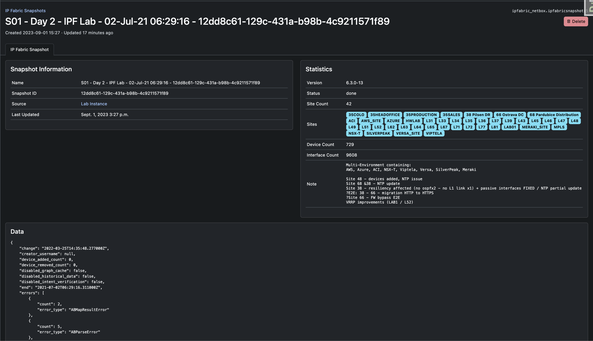
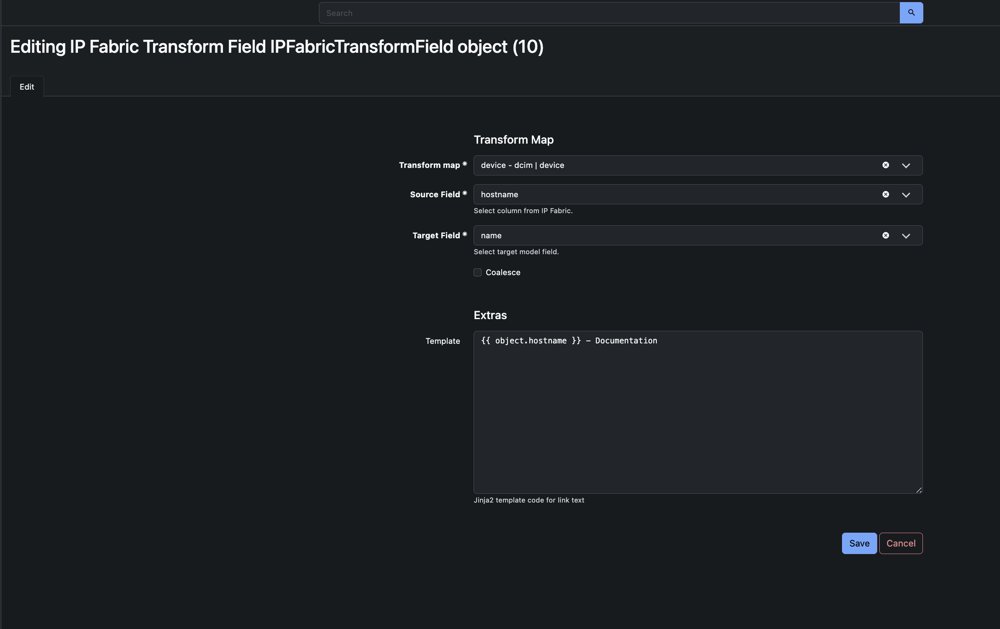
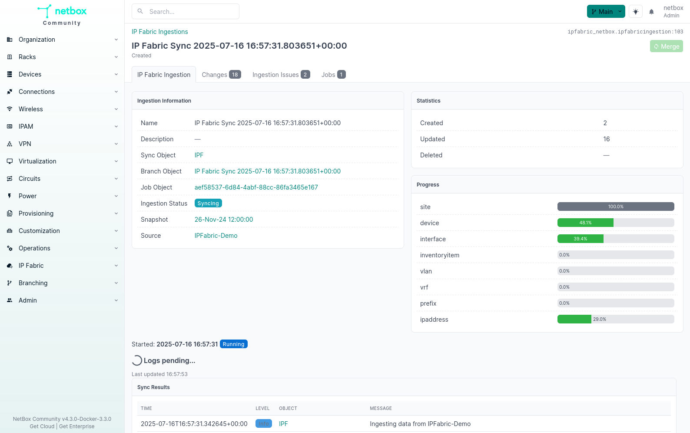
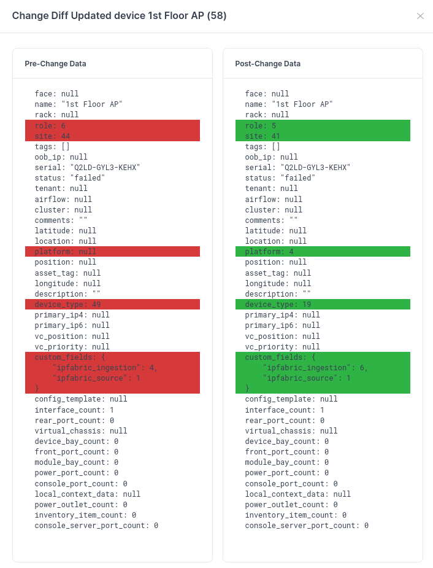

# Forward NetBox Plugin

## Forward

Forward is a vendor-neutral network assurance platform that automates the
holistic discovery, verification, visualization, and documentation of
large-scale enterprise networks, reducing the associated costs and required
resources whilst improving security and efficiency.

It supports your engineering and operations teams, underpinning migration and
transformation projects. Forward will revolutionize how you approach network
visibility and assurance, security assurance, automation, multi-cloud
networking, and trouble resolution.

**Integrations or scripts should not be installed directly on the Forward VM unless directly communicated from the
Forward Support or Solution Architect teams.  Any action on the Command-Line Interface (CLI) using the root, osadmin,
or autoboss account may cause irreversible, detrimental changes to the product and can render the system unusable.**

## Overview

This plugin allows the integration and data synchronization between Forward and NetBox.

The plugin communicates with Forward's REST API to gather inventory and topology data. Installing the optional Forward SDK (available via Forward Networks support) enhances some interactive workflows but is no longer required for data ingestion. The integration still relies on helpful NetBox features like [Branches](https://docs.netboxlabs.com/netbox-extensions/branching/) and [Background Tasks](https://netboxlabs.com/docs/netbox/en/stable/plugins/development/background-tasks/) to make the job of bringing in data to NetBox easier.

- Multiple Forward Sources
- Transform Maps
- Scheduled Synchronization
- Diff Visualization

## NetBox Compatibility
These are the required NetBox versions for corresponding plugin version. Any other versions won't work due to breaking changes in NetBox codebase.

| Netbox Version | Plugin Version |
|----------------|----------------|
| 4.4.0 and up   | 4.3.0 and up   |
| 4.3.0 - 4.3.7  | 4.2.2          |
| 4.3.0 - 4.3.6  | 4.0.0 - 4.2.1  |
| 4.2.4 - 4.2.9  | 3.2.2 - 3.2.4  |
| 4.2.0 - 4.2.3  | 3.2.0          |
| 4.1.5 - 4.1.11 | 3.1.1 - 3.1.3  |
| 4.1.0 - 4.1.4  | 3.1.0          |
| 4.0.1          | 3.0.1 - 3.0.3  |
| 4.0.0          | 3.0.0          |
| 3.7.0 - 3.7.8  | 2.0.0 - 2.0.6  |
| 3.4.0 - 3.6.9  | 1.0.0 - 1.0.11 |

## Screenshots

## Documentation

Full documentation for this plugin can be found at [Forward Docs](https://forwardnetworks.com/docs/forward-netbox).

- User Guide
- Administrator Guide

## Contributing

If you would like to contribute to this plugin, please see the [CONTRIBUTING.md](CONTRIBUTING.md) file.
