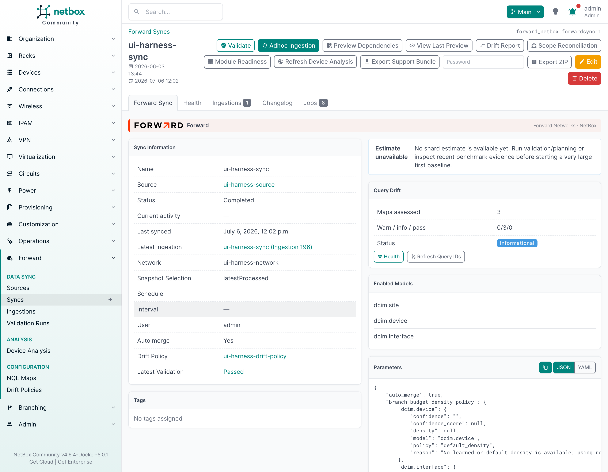
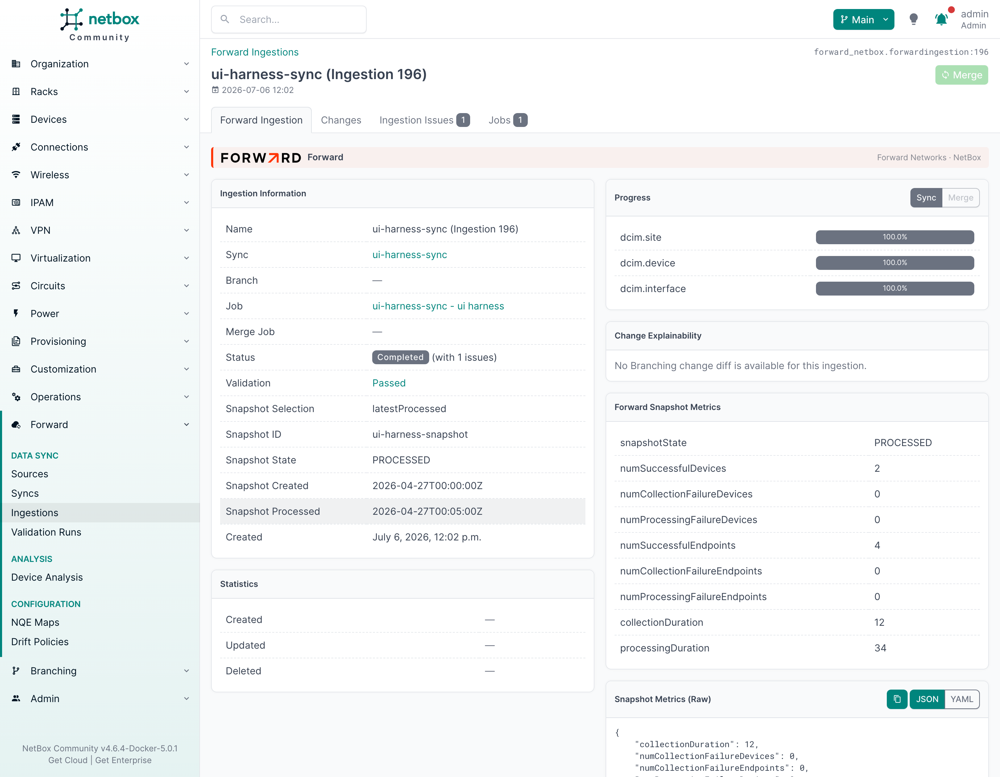
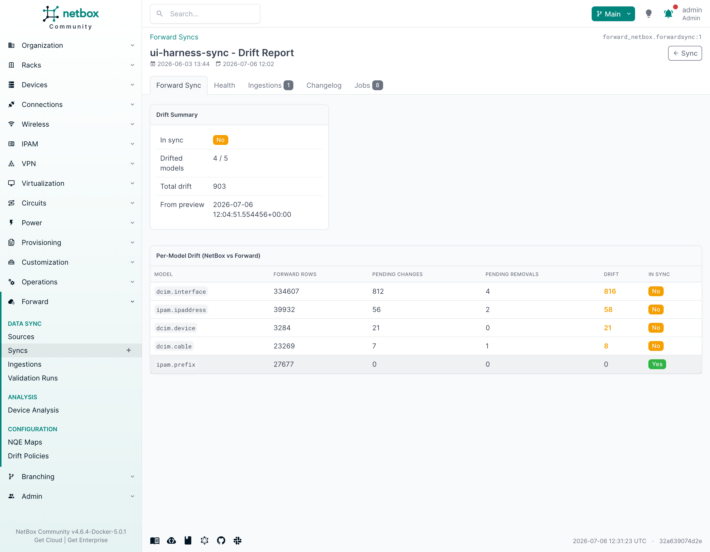
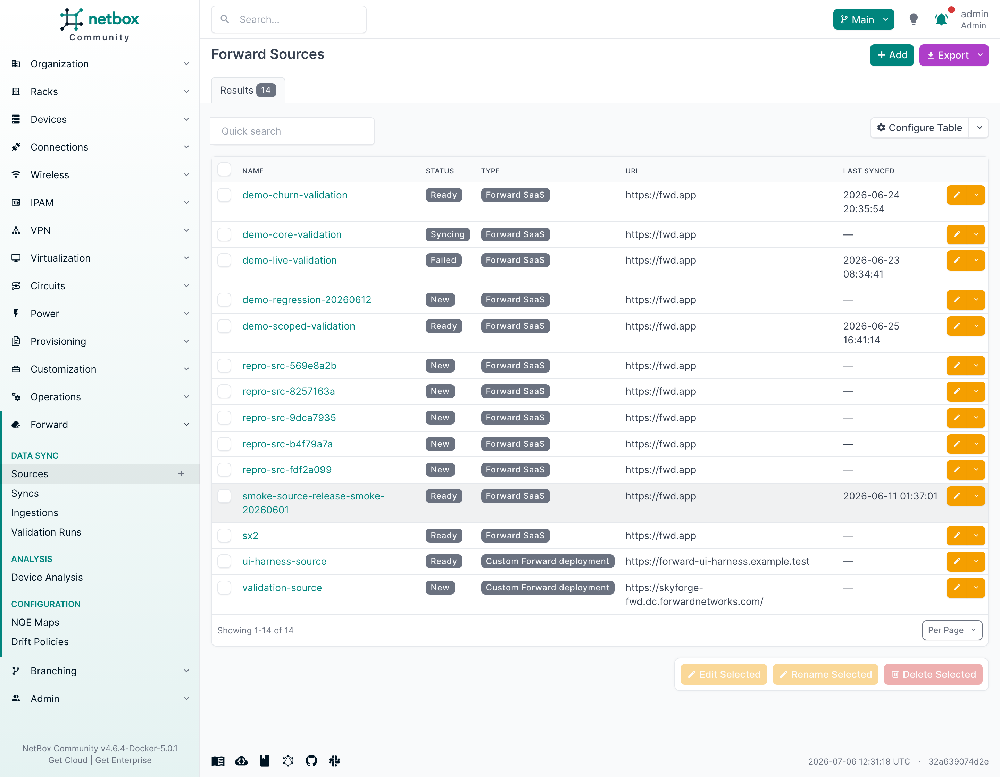

# Forward Integration for NetBox

**Forward Integration for NetBox** (`forward_netbox`) is a NetBox plugin that syncs Forward Networks inventory into NetBox.

[](https://pypi.org/project/forward-netbox/)
[](https://github.com/forwardnetworks/forward-netbox/actions/workflows/ci.yml)

## Status

- **Support model:** field integration reference — **not** an officially
  supported Forward Networks product.
- **Requires:** NetBox `4.6.4`, `netbox-branching` `1.1.0+`; Forward `26.6`
  baseline for async NQE (full matrix in
  [Release Compatibility](#release-compatibility)).
- **Distribution:** PyPI (`forward-netbox`) + GitHub releases.

## What It Does

It pulls your Forward-discovered inventory into NetBox — devices, interfaces, IP addresses, prefixes, VLANs, VRFs, cables, LAGs, MAC addresses, and inventory items. It runs Forward NQE against a chosen snapshot, stages every change in a `netbox_branching` branch so you can review the diff, then merges when it looks right.

On top of the import it adds scope control (sync only devices carrying chosen Forward tags), orphan pruning, per-device analysis (reachability, connectivity blast-radius, CVE exposure), a drift report, and snapshot selection.

## What It Does Not Do

- **It does not write back to Forward.** The sync is one-way, Forward → NetBox;
  Forward stays the source of truth and the plugin keeps NetBox populated from
  what Forward collected. (The drift report only *compares* the two.)
- **It is not a source of truth for Forward configuration or intent** — it
  populates NetBox from Forward's collected snapshot, nothing more.
- **It does not require** the optional `netbox-routing` / `netbox-peering-manager`
  plugins unless you enable the beta BGP/OSPF maps.

## Screenshots

**Sync — health, enabled models, and actions**



**Staged ingestion — progress, snapshot metrics, and issues**



**Drift report — per-model NetBox-vs-Forward divergence**



**Forward sources**



## Architecture

Forward NQE runs against a selected snapshot to fetch inventory, each model's
rows are staged into a `netbox_branching` branch as a reviewable per-model diff,
and you merge when the changes look correct. Large baselines can use a
`Fast bootstrap` direct-write backend; steady-state runs use Branching with
Forward `nqe-diffs` so every change is reviewable. See the
[Architecture Flow](docs/02_Reference/architecture-flow.md) reference for detail.

## Release Compatibility

Latest release requires NetBox `4.6.4` and `netbox-branching` `1.1.0+`. Expand for the full per-release history and notes.

<details>
<summary>Release compatibility history</summary>

| Plugin Release | NetBox Version | Status |
| --- | --- | --- |
| `v2.4.0` | `4.6.4` required; needs netbox-branching `1.1.0+` | Current release; Fix: the "Import SNMP Endpoints as Devices" toggle now renders on the source form (the field shipped in 2.3.2 but was not in any fieldset, so it never showed), letting operators enable endpoint import from the GUI. |
| `v2.3.2` | `4.6.4` required; needs netbox-branching `1.1.0+` | Superseded by `v2.4.0`; Feature: optional import of Forward SNMP endpoints (e.g. Avocent console servers) as NetBox devices — off by default (`sync_endpoints`), enabled per source and scoped by the same device tags. |
| `v2.3.1` | `4.6.4` required; needs netbox-branching `1.1.0+` | Superseded by `v2.3.2`;  |
| `v2.3.0` | `4.6.4` required; needs netbox-branching `1.1.0+` | Superseded by `v2.3.1`; GA/enterprise hardening: encrypted Forward credential at rest, PyPI Trusted Publishing + SBOM, Prometheus metrics + stuck-job alert, populated-DB upgrade test, dead-code removal (multi_branch/density-learning), reliability fixes (jittered/Retry-After backoff, SaaS rate clamp, PK-anchored device prune), and supported-product framing. Drop-in from 2.2.5 — stored credentials auto-encrypt on save; rotating SECRET_KEY requires re-entering them. |
| `v2.2.5` | `4.6.4` required; needs netbox-branching `1.1.0+` | Superseded by `v2.3.0`; Feature: operator-selectable **Sync Device Tags** — pick which Forward device tags (e.g. `Mgmt_*`) become NetBox device tags (replaces the hardcoded feature-tag set); Fix dependency-preview AttributeError + vsys job pile-up guard (hung pending); test/require NetBox 4.6.4 |
| `v2.2.4` | `4.6.3` required; needs netbox-branching `1.1.0+` | Superseded by `v2.2.5`; Hotfix: device-analysis NQE (bare foreach) errored refresh + CVE list; surface job errors into job.data |
| `v2.2.3` | `4.6.3` required; needs netbox-branching `1.1.0+` | Superseded by `v2.2.4`; Field-feedback fixes: delete-count labeling, vsys/vdom auto-link, skip empty VRFs, per-device CVE list, churn pinpoint, query-ID status clarify |
| `v2.2.2` | `4.6.3` required; needs netbox-branching `1.1.0+` | Superseded by `v2.2.3`; Fix 504 gateway timeouts on large syncs: stop recomputing change-explainability on every poll during a long merge + back off poll to 15s |
| `v2.2.1` | `4.6.3` required; needs netbox-branching `1.1.0+` | Superseded by `v2.2.2`; Add read-only forward_apply_identity_audit diagnostic to pinpoint 1-created/1-deleted idempotency churn |
| `v2.2.0` | `4.6.3` required; needs netbox-branching `1.1.0+` | Superseded by `v2.2.1`; Fix devices mis-assigned the ACI platform; link Palo vsys / Fortinet vdom firewalls to their physical chassis |
| `v2.1.5` | `4.6.3` required; needs netbox-branching `1.1.0+` | Superseded by `v2.2.0`; Fix Prune orphans erroring on empty sites that still hold a VLAN/VM/prefix (delete only truly-empty sites) |
| `v2.1.4` | `4.6.3` required; needs netbox-branching `1.1.0+` | Superseded by `v2.1.5`; Tag delete-eligible global IPAM (prefixes/VLANs/VRFs) for manual review |
| `v2.1.3` | `4.6.3` required; needs netbox-branching `1.1.0+` | Superseded by `v2.1.4`; Prune empty orphan sites (zero devices + zero racks) alongside out-of-scope devices |
| `v2.1.2` | `4.6.3` required; needs netbox-branching `1.1.0+` | Superseded by `v2.1.3`; Feature + docs: (1) new out-of-scope orphan health signal — the sync health summary now shows how many NetBox devices match none of the included Forward tags (removable via Scope Reconciliation -> Prune orphans), mirroring the backfilled signal, via a self-healing `forward-out-of-scope` device tag and a `?tag=forward-out-of-scope` filter; (2) docs: the "no covering prefix" diagnostic now names /32 and /128 host addresses (loopbacks, anycast, some VIPs), and the Operations Guide documents backfilled (in-scope, kept) vs out-of-scope (removable) devices. Drop-in from `2.1.1`. |
| `v2.1.1` | `4.6.3` required; needs netbox-branching `1.1.0+` | Superseded by `v2.1.2`; Bugfix + diagnostics: (1) the IPv4/IPv6 IP queries global dedup now pins the chosen interface to the chosen device (mirroring the VRF and MAC dedup blocks), so a deduped global address can no longer be attributed to an interface on a different device — the source of spurious "target interface was not imported" skips; (2) new read-only `forward_primary_ip_audit` command buckets Mgmt_ primary-IP resolution per device (resolvable / device-not-in-netbox / interface-not-matched / interface-present-no-IP) to pinpoint why a device does not get a primary IP. Drop-in from `2.1.0`. |
| `v2.1.0` | `4.6.3` required; needs netbox-branching `1.1.0+` | Superseded by `v2.1.1`; Feature: `forward_scope_ipam_audit` management command — a read-only audit listing network-global IPAM (prefixes, VLANs, VRFs) that NetBox holds but the sync's latest Forward fetch no longer reports, as manual-review candidates. Device-tag scope prune is device-derived and never removes global IPAM; this surfaces stale global objects without deleting anything (identity matching reuses the apply engine so verdicts match the sync). Drop-in from `2.0.8`. |
| `v2.0.8` | `4.6.3` required; needs netbox-branching `1.1.0+` | Superseded by `v2.1.0`; Bugfix: progress bars now reach 100% on a completed sync. For relationship and two-phase models (cable+termination, device+primary_ip, module+moduletype, fhrp group+assignment) the per-model bar settled below 100% because the merge `total` counts ChangeDiff rows while `current` counts applied objects; a finished job now renders every model at 100%. Cosmetic only — no apply/merge/data change. Drop-in from `2.0.7` |
| `v2.0.7` | `4.6.3` required; needs netbox-branching `1.1.0+` | Superseded by `v2.0.8`; Bugfixes + diagnostics: (1) a MAC whose target interface was not imported is now a benign aggregated skip like the IP path (with the canonical-name fallback), not a red `ForwardSearchError` failure; (2) the two benign IP diagnostics (filtered-unassignable, no-parent-prefix) collapse to one summary line each instead of a 20-row wall; (3) when a `require_diff` sync is blocked by a failed diff fetch, the block now names that cause and the `Allow full fallback` remedy. Drop-in from `2.0.6` |
| `v2.0.6` | `4.6.3` required; needs netbox-branching `1.1.0+` | Superseded by `v2.0.7`; Bugfix: stop the pernicious FHRP-group sync churn. When a virtual IP is shared by two HSRP/VRRP groups (different group_id), the second group was created then immediately deleted every sync (VIP-conflict), so a fixed set of FHRP groups was added and removed on every run. The second group now persists with its interface assignment (the VIP stays attached to the first group; NetBox allows a VIP on only one group), and deleting a shared-VIP group no longer removes the other group's VIP. Drop-in from `2.0.5` |
| `v2.0.5` | `4.6.3` required; needs netbox-branching `1.1.0+` | Superseded by `v2.0.6`; Branding + polish: the plugin is now presented as **Forward Field Integration** (NetBox plugin name, sidebar menu, docs/site titles). Adds a theme-aware Forward Networks logo + `#ff3506` accent bar at the top of the Source/Sync/Ingestion pages. Display-only: package `forward_netbox`, the `forward` URL prefix, NQE query names, and all APIs are unchanged. Drop-in from `2.0.4` |
| `v2.0.4` | `4.6.3` required; needs netbox-branching `1.1.0+` | Superseded by `v2.0.5`; Patch: collapse the module-sync readiness warning wall into ONE summary. When module sync is enabled before a device's module bays exist in NetBox, every module row is skipped; 2.0.3 capped the per-row lines at 3, this replaces them entirely with a single actionable line per sync (total skipped + a few examples + the `forward_module_readiness` remedy). Other skip reasons are unchanged. No engine/schema/org changes; drop-in from `2.0.3` |
| `v2.0.3` | `4.6.3` required; needs netbox-branching `1.1.0+` | Superseded by `v2.0.4`; Patch: (1) module-sync readiness warnings no longer flood the log — the per-row `module bay does not exist; run forward_module_readiness` skip is capped to a few examples plus a suppressed-count summary (was up to 20 near-identical lines per sync); (2) fixes the release `CI` gate (`CHANGELOG matches README`) that had been red since v1.7.2 — the generator no longer depends on git tag-date timing; (3) removes dead executor code (`ForwardFastBootstrapExecutor.run`) and refreshes stale internal docs. No engine/schema changes; drop-in from `2.0.2` |
| `v2.0.2` | `4.6.3` required; needs netbox-branching `1.1.0+` | Superseded by `v2.0.3`; Patch: apply_device_scope_tags now works with multiple include tags in `any` match mode — each device is tagged with exactly the include tag(s) it carries (resolved per-device at fetch time), instead of skipping. Also silences the spurious `Skipping untagged VLAN 1` warning (VID 1 is NetBox's implicit access default and is intentionally not imported). No engine/schema changes; drop-in from `2.0.1`, no org republish |
| `v2.0.1` | `4.6.3` required; needs netbox-branching `1.1.0+` | Superseded by `v2.0.2`; Patch: fixes two 2.0.0 regressions an operator hits immediately — a false `netbox_branching is not installed; syncs will fail` startup warning (the dependency check used the wrong distribution name), and a 500 on the Sync list page (`KeyError: 'available'` from a removed execution-ledger summary). No engine or data changes; drop-in upgrade from `2.0.0` |
| `v2.0.0` | `4.6.3` required; needs netbox-branching `1.1.0+` | Superseded by `v2.0.1`; Breaking 2.0 — single-branch is the only execution path. Removed the per-shard branching/fast-bootstrap/resumable executor, 10k-change budget sharding, and the execution-ledger run-history; dropped the backend/max-changes/scheduler-overlap selectors |
| `v1.7.2` | `4.6.3` required (4.5.x dropped); needs netbox-branching `1.1.0+` | Superseded by `v2.0.0`; Collection-gap diagnostics: per-reason backfill breakdown + staleness, growth/trend escalation, per-device collection result, ACI delete safety valve, opt-in auto-tag |
| `v1.7.1` | `4.5.9` and `4.6.2` validated; shared branch for `4.5.x` and `4.6.x` with capability-gated 4.6 features | Superseded by `v1.7.2`; ACI BD/L3Out graduation + FHRP churn fix (replaces yanked 1.7.0 and 1.6.2) |
| `v1.7.0` | `4.5.9` and `4.6.2` validated; shared branch for `4.5.x` and `4.6.x` with capability-gated 4.6 features | Superseded by `v1.7.1`; ACI bridge domain and L3Out NQE maps; query publish hardening |
| `v1.6.2` | `4.5.9` and `4.6.2` validated; shared branch for `4.5.x` and `4.6.x` with capability-gated 4.6 features | Superseded by `v1.7.0`; completes the 1.6.1 line (1.6.1 was yanked — its PyPI build predated these): device tag scope now covers VLANs/VRFs and prefixes derive from connected interface subnets; the FHRP group churn (delete+recreate every sync) is fixed by identity-bucket sharding; device analysis is a first-class model with a fleet list view, REST API, and an Open in Forward deep-link. |
| `v1.6.1` | `4.5.9` and `4.6.2` validated; shared branch for `4.5.x` and `4.6.x` with capability-gated 4.6 features | Superseded by `v1.6.2`; matures the 1.6.0 features and tooling — Device Analysis is now a NetBox model with a fleet-wide list view, REST API, and per-device-FK panel scoping (with up-interface blast-radius and opt-in post-sync refresh); adds a schedulable collection-gap alert command, run-history drill-down links, and hardened release tooling (one-command release script, generated CHANGELOG, conventional-commit hook). |
| `v1.6.0` | `4.5.9` and `4.6.2` validated; shared branch for `4.5.x` and `4.6.x` with capability-gated 4.6 features | Superseded by `v1.6.1`; ships the blue-sky tranche — release automation (`invoke release`), an Operations Guide, a collection-gap health signal, a sync run-history panel, a read-only device analysis panel (GA reachability / connectivity-degree blast radius / CVE exposure), and a bidirectional per-model drift report. |
| `v1.5.10` | `4.5.9` and `4.6.2` validated; shared branch for `4.5.x` and `4.6.x` with capability-gated 4.6 features | Superseded by `v1.6.0`; promotes `ipam.prefix` into the default bulk-ORM safe set (the last model still on the adapter path) — it runs the per-object tree apply so NetBox prefix hierarchy `_depth` stays correct, with null-VRF (global) prefix identity and canonical-CIDR matching parity-tested against the adapter. |
| `v1.5.9` | `4.5.9` and `4.6.2` validated; shared branch for `4.5.x` and `4.6.x` with capability-gated 4.6 features | Superseded by `v1.5.10`; adds a maintained `forward-backfilled` NetBox tag so operators can see which in-scope devices were backfilled (not freshly collected) in the latest snapshot — a Tag backfilled devices button on the Scope Reconciliation page plus a link to the filtered device list (`?tag=forward-backfilled`); the tag self-heals as devices collect again. |
| `v1.5.8` | `4.5.9` and `4.6.2` validated; shared branch for `4.5.x` and `4.6.x` with capability-gated 4.6 features | Superseded by `v1.5.9`; `dcim.module` sync now **adopts** the device interfaces Forward already syncs instead of recreating them (fixes `dcim_interface_unique_device_name` IntegrityError when modules are enabled), and `ipam.fhrpgroup` no longer churns (delete+recreate the same HSRP groups every sync) — the snapshot diff no longer deletes a group it is simultaneously upserting. Preview Dependencies now runs as a background job (cached result on the preview page), fixing a 504 timeout on large fabrics. |
| `v1.5.7` | `4.5.9` and `4.6.2` validated; shared branch for `4.5.x` and `4.6.x` with capability-gated 4.6 features | Superseded by `v1.5.8`; **Prune orphans** and **Create missing module bays** now run as background jobs (watch the Jobs tab) instead of synchronously, fixing a 504 gateway timeout on large fabrics. Module Readiness `Ready` reflects missing bays only (out-of-scope-device rows no longer hold it `No`), and the bulk `ipam.ipaddress` path tolerates duplicate global IPs. |
| `v1.5.6` | `4.5.9` and `4.6.2` validated; shared branch for `4.5.x` and `4.6.x` with capability-gated 4.6 features | Superseded by `v1.5.7`; fixes an `ipam.ipaddress` sync failure (`Ambiguous coalesce lookup`) when a reused /30 link range leaves duplicate global (VRF-less) IPs for the same host — the adapter now resolves to one deterministically (preferring the copy already on the synced interface) and warns, instead of failing the row. |
| `v1.5.5` | `4.5.9` and `4.6.2` validated; shared branch for `4.5.x` and `4.6.x` with capability-gated 4.6 features | Superseded by `v1.5.6`; surfaces the orphan-prune and module-bay readiness workflows in the sync detail UI (no CLI or CSV): a **Scope Reconciliation** page with a **Prune orphans** button, and a **Module Readiness** page with a **Create missing module bays** button that creates the bays directly in NetBox. |
| `v1.5.4` | `4.5.9` and `4.6.2` validated; shared branch for `4.5.x` and `4.6.x` with capability-gated 4.6 features | Superseded by `v1.5.5`; adds `--prune-orphans`/`--apply` to `forward_device_scope_reconciliation_audit` to delete stale out-of-scope (orphan) NetBox devices left by an earlier broader sync that `device_tag_prune_out_of_scope` cannot reach (orphans are absent from the scoped Forward result). Dry-run by default; tagged-but-backfilled devices are preserved. |
| `v1.5.3` | `4.5.9` and `4.6.2` validated; shared branch for `4.5.x` and `4.6.x` with capability-gated 4.6 features | Superseded by `v1.5.4`; classifies APIC controllers onto the `APIC` platform (distinct from ACI switches) so controller and switch software versions model separately; splits IP address import into independent `Forward IPv4 IP Addresses` and `Forward IPv6 IP Addresses` maps (a migration removes the combined map) so address families toggle independently; promotes `dcim.interface` and `ipam.ipaddress` into the default bulk-ORM safe set and removes bulk-apply update churn across every bulk model so steady-state syncs issue no redundant writes; preserves operator platform-manufacturer overrides on bulk update; and adds the opt-in `Apply Device Scope Tags` source option plus the `forward_device_scope_reconciliation_audit` and `forward_apic_cimc_readiness_audit` commands. |
| `v1.5.2` | `4.5.9` and `4.6.2` validated; shared branch for `4.5.x` and `4.6.x` with capability-gated 4.6 features | Superseded by `v1.5.3`; collapses the flood of `dcim.modulebay` branch-merge failures (a NetBox Branching/MPTT limitation when a new device's module bays are auto-instantiated in a branch) into a single actionable `ModuleBayMergeUnsupported` ingestion issue that points at the `forward_module_readiness` import workflow. Device and interface sync are unaffected. |
| `v1.5.1` | `4.5.9` and `4.6.2` validated; shared branch for `4.5.x` and `4.6.x` with capability-gated 4.6 features | Superseded by `v1.5.2`; adds the `latestCollected` snapshot selector that skips backfilled (collection-canceled) snapshots and resolves to the most recent snapshot with a freshly-collected in-scope device, warns when a `latestProcessed` run finds every in-scope device backfilled instead of silently applying zero changes, records the resolved snapshot's own metadata for `latestCollected` runs, and adds an Architecture Flow reference doc. |
| `v1.5.0.1` | `4.5.9` and `4.6.2` validated; shared branch for `4.5.x` and `4.6.x` with capability-gated 4.6 features | Superseded by `v1.5.1`; fixes platform NQE query using `normalizePlatformName` to avoid evaluation failures on unsupported vendor/OS combinations, adds `--overwrite` flag to the validation-org repair command, and hardens the NQE org-publish commit loop to retry after 409 INVALID_CHANGE_PATH. |
| `v1.5.0` | `4.5.9` and `4.6.2` validated; shared branch for `4.5.x` and `4.6.x` with capability-gated 4.6 features | Superseded by `v1.5.0.1`; hardens ingest throughput via adaptive async-NQE poll backoff, ndjson streaming, webhook/event-rule signal suppression during the apply loop, targeted validation (skips DB-hitting uniqueness checks on existing objects in both simple and tree-model bulk paths), and async advanced-reachability trigger (FWD-53559). Full test suite green on NetBox 4.5.9 (1092/0/0) and 4.6.2 (1092/0/26 routing-plugin version-gated). |
| `v1.4.3` | `4.5.9` and `4.6.2` validated; shared branch for `4.5.x` and `4.6.x` with capability-gated 4.6 features | Superseded by `v1.5.0`; hardens query-path provenance by requiring source-backed query-id repair at preflight, enforces async NQE source parsing for 26.6 execution paths, proves CIMC/APIC custom-command updates in source and keeps the 1.4 production-hardening line intact. |
| `v1.4.2` | `4.5.9` and `4.6.2` validated; shared branch for `4.5.x` and `4.6.x` with capability-gated 4.6 features | Superseded by `v1.4.3`; adds CIMC platform separation, visible query-drift repair and dependency preview on the sync detail page, and keeps the module-bay merge hardening plus parent-interface description preservation from the prior patch line. |
| `v1.4.1.1` | `4.5.9` and `4.6.1` validated; shared branch for `4.5.x` and `4.6.x` with capability-gated 4.6 features | Superseded by `v1.4.2`; prevents optional `dcim.module` sync from emitting merge-breaking `dcim.modulebay` side-effect creates when module bays are missing and prevents LAG member rows from clearing existing parent interface descriptions. |
| `v1.4.1` | `4.5.9` and `4.6.1` validated; shared branch for `4.5.x` and `4.6.x` with capability-gated 4.6 features | Superseded by `v1.4.2`; keeps the hard parent-device sync contract, adds query-ID drift remediation plus support-bundle diagnostics, and carries the 1.4 production-hardening tranche forward as the release line. |
| `v1.4.0` | `4.5.9` and `4.6.1` validated; shared branch for `4.5.x` and `4.6.x` with capability-gated 4.6 features | Superseded by `v1.4.1`; enforces a hard parent-device sync contract so child models cannot run without `dcim.device`, which prevents stale sync configs from skipping the device shard and breaking dependent imports. |
| `v1.3.5.5` | `4.5.9` and `4.6.1` validated; shared branch for `4.5.x` and `4.6.x` with capability-gated 4.6 features | Superseded by `v1.3.6`; adds compressed support-bundle ZIP downloads with optional password protection, and folds live source health, live query-drift, and live data-file diagnostics into the troubleshooting bundle so operator support can work from one artifact. |
| `v1.3.5.4` | `4.5.9` and `4.6.1` validated; shared branch for `4.5.x` and `4.6.x` with capability-gated 4.6 features | Superseded by `v1.3.5.5`; repackaged the `1.3.5.3` query-contract hardening on a fresh patch tag and kept strict shipped-query parameter-contract validation, legacy tag alias stripping, and summary-only support-bundle previews. |
| `v1.3.5.3` | `4.5.9` and `4.6.1` validated; shared branch for `4.5.x` and `4.6.x` with capability-gated 4.6 features | Superseded by `v1.3.5.4`; keeps the `1.3.5.2` claimed-step and payload compaction behavior, adds strict shipped-query parameter-contract validation, strips legacy tag aliases from runtime NQE payloads, and keeps support-bundle previews summary-only. |
| `v1.3.5.1` | `4.5.9` and `4.6.1` validated; shared branch for `4.5.x` and `4.6.x` with capability-gated 4.6 features | Superseded by `v1.3.5.2`; removes raw `model_results` from the sync telemetry summary and prevents unparameterized query IDs from receiving source-level tag parameters, which keeps the sync detail view responsive and preserves the saved-query-ID path compatibility. |
| `v1.3.5` | `4.5.9` and `4.6.1` validated; shared branch for `4.5.x` and `4.6.x` with capability-gated 4.6 features | Superseded by `v1.3.5.2`; keeps the 1.3.x saved-query-ID path parameter-compatible, tightens ACI platform detection with command-inventory signals, and preserves the lower-noise execution accounting used by the 1.3.x sync path |
| `v1.3.4` | `4.5.9` and `4.6.1` validated; shared branch for `4.5.x` and `4.6.x` with capability-gated 4.6 features | Superseded by `v1.3.5`; makes non-retryable Branching merge failures visible in job logs, leaves failed merge branches in a terminal `Failed` state instead of stale `Merging`, and carries disabled async NQE client staging for future Forward 26.6 support |
| `v1.3.3` | `4.5.9` and `4.6.1` validated; shared branch for `4.5.x` and `4.6.x` with capability-gated 4.6 features | Superseded by `v1.3.5.2`; refreshes bundled NQE syntax for saved query-ID execution, keeps all shipped maps parameter-compatible with `forward_netbox_shard_keys`, and updates the saved validation-folder query IDs used by the 1.3.x sync path |
| `v1.3.2` | `4.5.9` and `4.6.1` validated; shared branch for `4.5.x` and `4.6.x` with capability-gated 4.6 features | Superseded by `v1.3.3`; adds optional `netbox-cisco-aci` integration maps and adapter support, keeps ACI maps disabled by default, preserves parameterized NQE execution, and validates repeat-sync idempotence for the proven ACI write path |
| `v1.3.1` | `4.5.9` and `4.6.1` validated; shared branch for `4.5.x` and `4.6.x` with capability-gated 4.6 features | Superseded by `v1.3.2`; preserves the `v1.3.0` parameterized NQE path, removes the legacy sync column-filter shard path, and fixes repeat prefix sync accounting so unchanged `ipam.prefix` rows report as unchanged instead of update churn |
| `v1.3.0` | `4.5.9` and `4.6.1` validated; shared branch for `4.5.x` and `4.6.x` with capability-gated 4.6 features | Superseded by `v1.3.1`; eliminates default Forward NQE column-filter shard fetches in favor of query-side `forward_netbox_shard_keys` parameters, keeps local shard safety filtering, and preserves branch boundaries while reducing Forward SaaS API/NQE pressure |
| `v1.2.3` | `4.5.9` and `4.6.1` validated; shared branch for `4.5.x` and `4.6.x` with capability-gated 4.6 features | Superseded by `v1.3.0`; further reduced Forward SaaS API/NQE pressure by coalescing compatible sibling shard EQUALS_ANY filters, added local change-explainability summaries, and kept staged branch boundaries unchanged |
| `v1.2.1` | `4.5.9` and `4.6.1` validated; shared branch for `4.5.x` and `4.6.x` with capability-gated 4.6 features | Superseded by `v1.2.2`; fixes prefix VRF churn by making `ipam.prefix` identity exact for global and VRF-scoped rows while preserving parameterized prefix shard NQE execution |
| `v1.2.0` | `4.5.9` and `4.6.1` validated; shared branch for `4.5.x` and `4.6.x` with capability-gated 4.6 features | Superseded by `v1.2.1`; adds optional NetBox-native HSRP/VRRP FHRP import, bounded access/native interface VLAN assignment from existing site-scoped VLANs, upgrade-safe FHRP VIP conflict handling, and NetBox 4.6 job-test compatibility hardening while preserving the 1.1 API/NQE limits |
| `v1.1.1` | `4.5.9` and `4.6.1` validated; shared branch for `4.5.x` and `4.6.x` with capability-gated 4.6 features | Superseded by `v1.2.0`; adds optional NetBox-native HSRP/FHRP import, upgrade-safe FHRP VIP conflict handling, and NetBox 4.6 job-test compatibility hardening while preserving the 1.1 API/NQE limits |
| `v1.1.0` | `4.5.9` and `4.6.1` validated; shared branch for `4.5.x` and `4.6.x` with capability-gated 4.6 features | Superseded by `v1.1.1`; reduces Forward SaaS API/NQE pressure with source-level API pacing, parameterized prefix shard queries, single-pass interface NQE, and release-validation smoke evidence |
| `v1.0.0` | `4.5.9` and `4.6.1` validated; shared branch for `4.5.x` and `4.6.x` with capability-gated 4.6 features | Superseded by `v1.1.0`; first 1.x release line with API/NQE stability groundwork but without 1.1 API pacing and scale-optimized query improvements |
| `v0.9.4.6` | `4.5.9` and `4.6.1` validated; shared branch for `4.5.x` and `4.6.x` with capability-gated 4.6 features | Superseded by `v1.1.0`; tightens delete-heavy device cleanup shard planning after live evidence showed device deletes still exceeded native Branching change-budget guidance |
| `v0.9.4.5` | `4.5.9` and `4.6.0` validated; shared branch for `4.5.x` and `4.6.x` with capability-gated 4.6 features | Superseded by `v0.9.4.6`; plans delete-heavy device cleanup shards more conservatively so tag-scope prune runs stay closer to native Branching change-budget guidance |
| `v0.9.4.4` | `4.5.9` and `4.6.0` validated; shared branch for `4.5.x` and `4.6.x` with capability-gated 4.6 features | Superseded by `v0.9.4.5`; clarifies large branching progress by clamping progress-bar display and surfacing current shard row progress in the ingestion UI |
| `v0.9.4.3` | `4.5.9` and `4.6.0` validated; shared branch for `4.5.x` and `4.6.x` with capability-gated 4.6 features | Superseded by `v0.9.4.4`; hardens delete behavior by converting protected-reference delete failures into dependency skips so tag-scope prune/device cleanup runs continue safely |
| `v0.9.4.1.1` | `4.5.9` and `4.6.0` validated; shared branch for `4.5.x` and `4.6.x` with capability-gated 4.6 features | Superseded by `v0.9.4.3`; keeps the shared-branch architecture, execution ledger, support logging, and scale hardening while preserving the read-only advisory surfaces from `v0.9.0` |
| `v0.9.0` | `4.5.9` and `4.6.0` validated; shared branch for `4.5.x` and `4.6.x` with capability-gated 4.6 features | Superseded by `v0.9.4.1.1`; adds read-only analysis, workload preview, advisory summaries, and native log export for troubleshooting while keeping lifecycle enrichment and predict deferred |
| `v0.8.6.3` | `4.5.9` validated; `4.5.x` only | Superseded by `v0.9.4.1.1`; hardens beta routing scope resolution, invalid ASN filtering, conservative virtual chassis skips, and fast-bootstrap baseline readiness when only optional model issues remain |
| `v0.8.6.2` | `4.5.9` validated; `4.5.x` only | Superseded by `v0.8.6.3`; hardens issue and job-log rendering so unexpected nested payload objects stay JSON-safe in the UI and API |
| `v0.8.6.1` | `4.5.9` validated; `4.5.x` only | Superseded by `v0.8.6.2`; clarifies the native NQE map bulk edit workflow so repository-path mode and runtime query-ID resolution are explicit in the UI |
| `v0.8.6` | `4.5.9` validated; `4.5.x` only | Superseded by `v0.8.6.1`; refreshes org-repository query publishing with flattened built-ins, filters invalid IPv4 prefix artifacts, adds parent-prefix diagnostics, and hardens virtual chassis/device and routing issue handling |
| `v0.8.5` | `4.5.9` validated; `4.5.x` only | Superseded by `v0.8.6`; makes the beta routing and module maps broadly available by default while keeping virtual chassis conservative, hardens repository query lookup responses, and clears stale row progress when a sync fails or advances phases |
| `v0.8.4` | `4.5.9` validated; `4.5.x` only | Superseded by `v0.8.5`; stops importing Forward HA peers as NetBox virtual chassis by default, hardens repository query lookup responses, and clears stale row progress when a sync fails or advances phases |
| `v0.8.3` | `4.5.9` validated; `4.5.x` only | Superseded by `v0.8.4`; isolates per-model query failures, blocks positionless virtual-chassis assignments before NetBox save, and lets later shards such as routing continue while withholding dirty diff baselines |
| `v0.8.2` | `4.5.9` validated; `4.5.x` only | Superseded by `v0.8.3`; adds portable repository query-path execution with native NetBox selectors, publish-and-bind bulk edit, bidirectional restore, and fixes IP address rows whose Forward interface cannot be resolved |
| `v0.8.1.1` | `4.5.9` validated; `4.5.x` only | Superseded by `v0.8.2`; fixes virtual chassis NQE output so NetBox receives a member position with virtual chassis assignments |
| `v0.8.1` | `4.5.9` validated; `4.5.x` only | Superseded by `v0.8.1.1`; fixes fast-bootstrap native change tracking/statistics and adds timeout guidance plus transient Forward API HTTP retries |
| `v0.8.0` | `4.5.9` validated; `4.5.x` only | Superseded by `v0.8.1`; adds an opt-in fast bootstrap backend for trusted large baselines while keeping Branching as default, and skips NetBox-invalid LAG cable endpoints |
| `v0.7.1` | `4.5.9` validated; `4.5.x` only | Superseded by `v0.8.0`; keeps the NetBox-native multi-branch workflow, adds shard heartbeat visibility, and hardens large-shard retries and cable ingestion handling |
| `v0.7.0` | `4.5.9` validated; `4.5.x` only | Superseded by `v0.7.1`; extracts the 0.7 sync boundaries and adds shard heartbeat visibility |
| `v0.6.5` | `4.5.9` validated; `4.5.x` only | Superseded by `v0.7.0`; adds audited validation force-allow overrides and routing evidence enrichment; optional routing/peering import remains beta; native `dcim.module` import is beta |
| `v0.6.4` | `4.5.9` validated; `4.5.x` only | Superseded by `v0.6.5`; optional routing/peering import is beta; native `dcim.module` import is beta |
| `v0.6.3` | `4.5.9` validated; `4.5.x` only | Superseded by `v0.6.4`; native `dcim.module` import is beta |
| `v0.6.2` | `4.5.9` validated; `4.5.x` only | Superseded by `v0.6.3`; native `dcim.module` import is beta |
| `v0.6.1` | `4.5.9` validated; `4.5.x` only | Superseded by `v0.6.2`; native `dcim.module` import is beta |
| `v0.6.0` | `4.5.9` validated; `4.5.x` only | Superseded by `v0.6.1`; native `dcim.module` import is beta |
| `v0.5.9.1` | `4.5.9` validated; `4.5.x` only | Superseded by `v0.6.0` |
| `v0.5.9` | `4.5.9` validated; `4.5.x` only | Superseded by `v0.5.9.1` |
| `v0.5.8` | `4.5.9` validated; `4.5.x` only | Superseded by `v0.5.9` |
| `v0.5.7` | `4.5.9` validated; `4.5.x` only | Superseded by `v0.5.8` |
| `v0.5.2.1` | `4.5.9` validated; `4.5.x` only | Superseded by `v0.5.3` |
| `v0.4.0` | `4.5.9` validated; `4.5.x` only | Superseded by `v0.5.2.1` |
| `v0.3.1` | `4.5.8` validated; `4.5.x` only | Superseded by `v0.4.0` |
| `v0.3.0.1` | `4.5.8` validated; `4.5.x` only | Superseded by `v0.3.1` |
| `v0.3.0` | `4.5.8` validated; `4.5.x` only | Superseded by `v0.3.0.1` |

</details>

## Support

This is a **field integration** maintained by a Forward Networks SE — a reference
integration, **not an officially supported Forward Networks product**, provided
as-is with no SLA. Supported NetBox and `netbox-branching` versions are listed in
the Release Compatibility table above; fixes target the latest released version.

- **Bugs / feature requests:** open a GitHub issue using the provided templates.
- **Security vulnerabilities:** report privately per [SECURITY.md](SECURITY.md) —
  do not open a public issue.
- **Upgrades:** follow the [Upgrade and Rollback guide](docs/01_User_Guide/upgrade.md);
  back up the NetBox database before upgrading.

Deploy on a supported NetBox version and review the deployment security notes in
`SECURITY.md` (credential-at-rest and the sync trust boundary) before production
use.

## Features

- Branch-backed sync, diff, and merge flow through `netbox_branching`
- Forward `Sources`, `NQE Maps`, `Syncs`, and `Ingestions`
- Built-in shipped NQE maps seeded automatically after migration
- Support for repository `query_path`, direct Forward `query_id`, or raw NQE `query` text
- Explicit identity contracts per map (`coalesce_fields`) with strict sync-time ambiguity detection
- Repository-authored built-in queries can share local helper modules and still execute as flattened raw NQE when bundled
- Automatic paging across multi-page Forward NQE result sets during sync execution
- Optional disabled NQE maps for NetBox Device Type Library alias matching through a Forward JSON data file
- Optional disabled NQE map for data-file-driven device feature tag rules
- Feature-flagged beta BGP and OSPF maps for optional `netbox-routing` and `netbox-peering-manager` deployments
- Snapshot-aware execution with `latestProcessed` or an explicit Forward snapshot per sync
- Ingestion records that preserve the selected snapshot mode, resolved snapshot ID, and Forward snapshot metrics
- Built-in coverage for:
  - `dcim.site`
  - `dcim.manufacturer`
  - `dcim.devicerole`
  - `dcim.platform`
  - `dcim.devicetype`
  - `dcim.device`
  - `dcim.virtualchassis`
  - device feature tags
  - `dcim.interface`
  - `dcim.cable` from exact Forward inferred interface matches
  - `dcim.macaddress`
  - `dcim.inventoryitem`
  - optional beta `dcim.module`
  - optional beta BGP peers, BGP address families, OSPF objects, and peering sessions through external NetBox plugins
  - `ipam.vlan`
  - `ipam.vrf`
  - `ipam.prefix` for IPv4 and IPv6
  - `ipam.ipaddress`

## Quickstart

1. Install the plugin into the same Python environment as NetBox:

Install the latest release from PyPI:

```bash
pip install forward-netbox
```

Or install a specific wheel or source archive from GitHub Releases:

```bash
pip install /path/to/forward_netbox-2.2.5-py3-none-any.whl
```

2. Enable both plugins in the NetBox configuration:

```python
PLUGINS = [
    "netbox_branching",
    "forward_netbox",
]
```

3. Apply migrations:

```bash
python manage.py migrate
```

4. Open NetBox and create a `Forward Source`.
5. Select a Forward network for that source.
6. Create a `Forward Sync`, choose the snapshot selector, and enable the NetBox models you want to sync.
7. Run an adhoc ingestion, review the staged branch diff, review the recorded snapshot details and metrics, and merge when the changes look correct.

For large datasets, prefer committed Forward Org Repository queries referenced by `query_id`, leave `Snapshot` at `latestProcessed`, and establish one clean baseline first. Use the default `Branching` backend when the initial changes should be reviewed in native NetBox Branching shards. Use `Fast bootstrap` only for trusted initial baselines where direct NetBox writes are acceptable; it keeps the same NQE, preflight, model validation, ingestion issue reporting, and native NetBox change tracking contracts but does not create review branches. After a fast-bootstrap baseline completes, switch the sync back to `Branching` so later `latestProcessed` runs can use Forward `nqe-diffs` and remain reviewable.

The shipped query set includes both default maps and optional alias-aware maps. If your NetBox device types are pre-loaded from the NetBox Device Type Library, upload a Forward JSON data file named `netbox_device_type_aliases.json` with NQE name `netbox_device_type_aliases`, attach it to the Forward network, and run or reprocess a Forward snapshot before enabling the disabled alias-aware device maps or using committed query IDs for those variants. The NetBox plugin runs public `/api/nqe` against the selected snapshot, so latest uploaded data files do not affect plugin sync results until the selected snapshot exposes the data file value. The generated file carries both device type aliases and manufacturer override rows for the alias-aware maps. Without that data file in the selected snapshot, leave the default non-data-file maps enabled.

## Test It Yourself

Use this quick validation flow after installation:

1. Create a `Forward Source` using `https://fwd.app` or your custom Forward URL.
2. Enter a Forward username and password, then confirm the `Network` field populates from the live Forward tenant.
3. Open `NQE Maps` and verify the built-in maps are present.
4. Create a `Forward Sync` tied to the source, leaving `Snapshot` at `latestProcessed` for the first run.
5. Run the sync from the sync detail page.
6. Review the generated `Forward Ingestion`, `Issues`, snapshot details, snapshot metrics, and change diff.
7. Merge the branch and confirm the synced objects appear in NetBox.

## Local Validation

The repository now includes local validation tasks:

- `invoke forward_netbox.lint`
- `invoke forward_netbox.check`
- `invoke forward_netbox.test`
- `invoke forward_netbox.docs`
- `invoke forward_netbox.package`
- `invoke forward_netbox.ci`

For a live Forward smoke run outside CI, set these environment variables and run the smoke task locally:

```bash
export FORWARD_SMOKE_USERNAME='your-forward-username'
export FORWARD_SMOKE_PASSWORD='your-forward-password'
export FORWARD_SMOKE_NETWORK_ID='your-network-id'
invoke forward_netbox.smoke-sync
```

Optional smoke-sync variables:

- `FORWARD_SMOKE_URL` defaults to `https://fwd.app`
- `FORWARD_SMOKE_SNAPSHOT_ID` defaults to `latestProcessed`
- `FORWARD_SMOKE_MODELS` accepts a comma-separated subset such as `dcim.site,dcim.device,dcim.interface`
- `invoke forward_netbox.smoke-sync --validate-only` runs live snapshot/query validation without executing an ingestion
- `invoke forward_netbox.smoke-sync --plan-only` prints the native NetBox Branching shard plan without creating branches
- `invoke forward_netbox.smoke-sync --max-changes-per-branch 10000` stages and merges large baselines in multiple native branches
- `invoke forward_netbox.smoke-sync --no-auto-merge --max-changes-per-branch 10000` stages one shard and pauses for review
- `invoke forward_netbox.smoke-sync --execution-backend fast_bootstrap` runs the trusted direct-write baseline backend after validation

Normal UI/API sync jobs default to native multi-branch execution, with a default branch budget of `10000` changes. `Auto merge` controls whether Branching shards advance automatically or pause for review after each shard. For trusted large baselines, select the fast bootstrap execution backend and switch back to Branching for reviewable steady-state diffs. See the [Initial Baseline Strategy](docs/01_User_Guide/configuration.md#initial-baseline-strategy) for the decision table.

## Documentation

- [Documentation Home](docs/README.md)
- [Installation](docs/01_User_Guide/README.md)
- [Configuration](docs/01_User_Guide/configuration.md)
- [Usage and Validation](docs/01_User_Guide/usage.md)
- [Troubleshooting](docs/01_User_Guide/troubleshooting.md)
- [Architecture Flow](docs/02_Reference/architecture-flow.md)
- [Built-In NQE Reference](docs/02_Reference/built-in-nqe-maps.md)
- [Device Type Alias Data File](docs/02_Reference/device-type-alias-data-file.md)
- [Model Mapping Matrix](docs/02_Reference/model-mapping-matrix.md)
- [Shipped NQE Query Files](https://github.com/forwardnetworks/forward-netbox/tree/main/forward_netbox/queries)
- [License](LICENSE)
