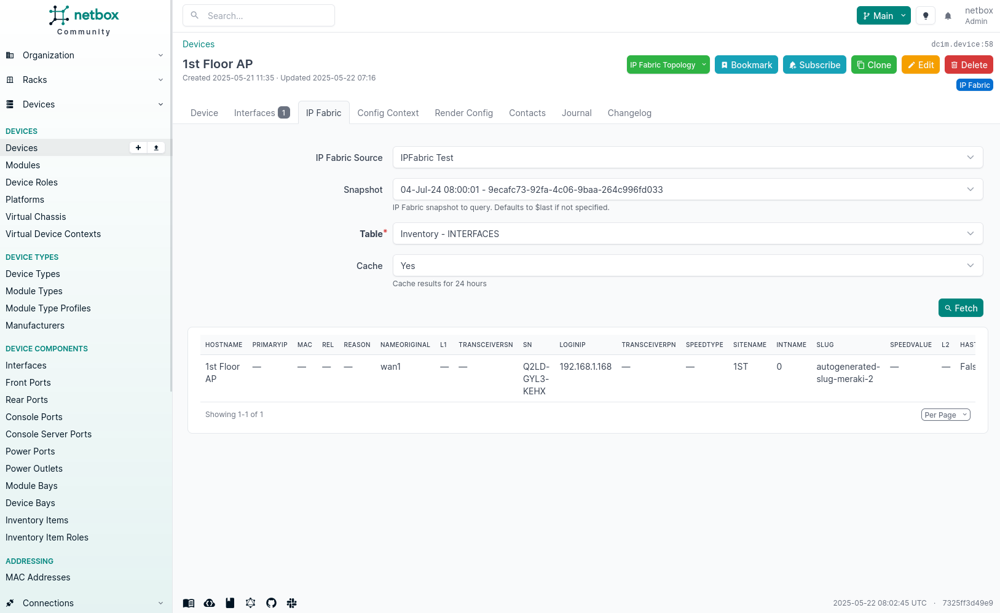
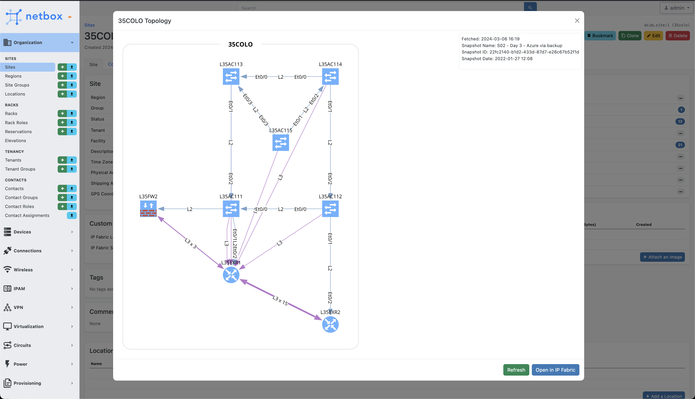

# Extras

## NetBox Cloud

There are some challenges when using the Forward NetBox plugin with NetBox Cloud. The plugin is designed to run on the NetBox server which has reachability to an Forward instance. To overcome this limitation, we have developed a NetBox Cloud Remote data collection feature. This feature allows users to collect data from Forward instances with a Python script which will push all the data required for the plugin to function effectively to your instance of NetBox Cloud. Once the raw data has been pushed up, the transformation process will run as normal.

To enable this, you can simply add an Forward instance with the type `Remote`, and this will enable the remote data collection feature.

Enabling this will limit some functionality of the plugin such as:

- Device Tables

## Device Tables

Forward encompasses an extensive array of configuration and operational state data for devices, not all of which can be synchronized into NetBox. The plugin offers a means to seamlessly view this data within NetBox by dynamically generating tables for each Forward table, allowing the use of serial numbers as filters for output.

These tables will be available as a tab under all devices. If no serial number is available, users will be unable to perform a lookup as we require the serial number to filter the Forward API data.

The default behavior in Forward involves utilizing the `$last` snapshot to generate the table. However, users have the option to manually modify this by changing the **snapshot** form field. Additionally, the Forward Source field allows specifying an alternative Forward instance for the lookup; by default, the source last used to synchronize the device will be used.

The cache can be used to store the data for a given device, allowing for faster lookups. This is enabled by default but can be disabled by unchecking the **Cache** checkbox. The cache will be updated every time the Forward API is queried. The cache is stored for 24 hours.

## Site Topology

If sites have been synced with the plugin and have the `Forward Source` custom field set a button will apear with the ability to get a topology of the `$last` or `$prev` snapshot. The will communicate with the Forward API to generate a topology (SVG) for the site showing the devices and links between them. You can also use the link provided below to open the topology directly in Forward for further analysis and interaction.

