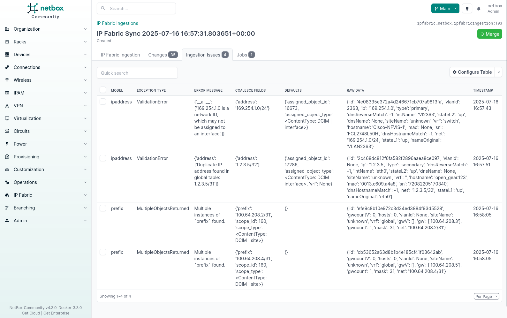
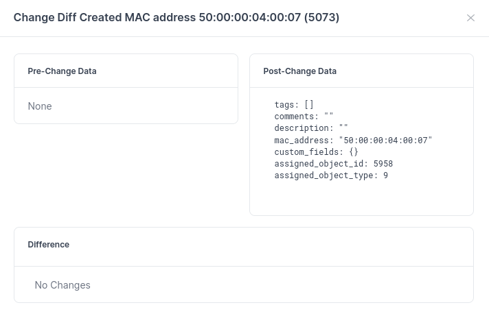
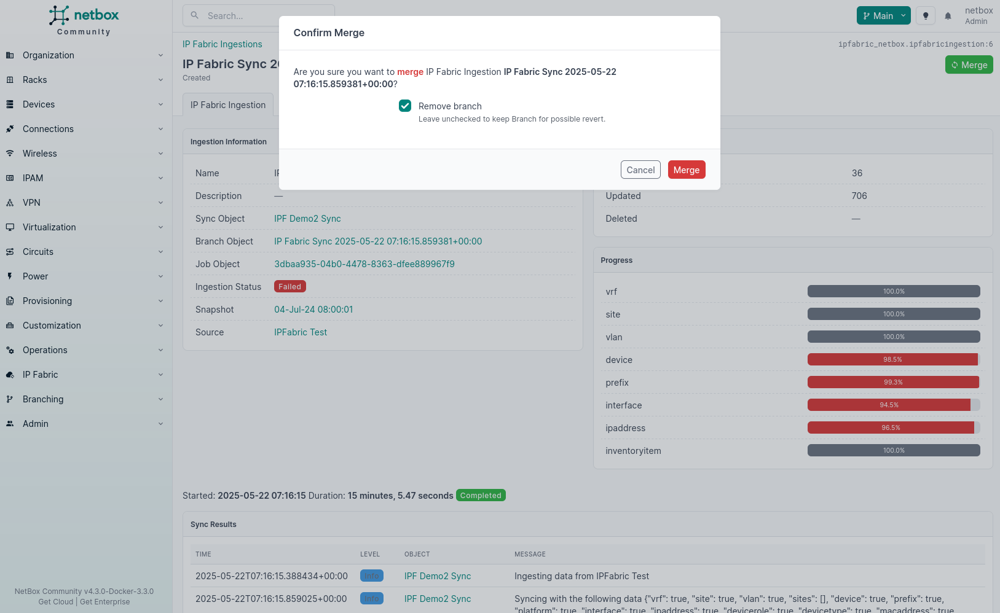

# Ingestions

## Overview

This plugin relies heavily on a feature from NetBox Branching plugin known as **Branches**, which is a crucial component for the proper functioning of the plugin. We've found significant success using this feature to address various use cases. For a more comprehensive explanation of Branches, please refer to the [official NetBox Branching plugin documentation](https://docs.netboxlabs.com/netbox-extensions/branching).

!!! info

    If the ingestion job is configured to automatically merge changes, the plugin will automatically merge the changes into the NetBox database once the ingestion reaches the **`completed`** state.

## Branches in NetBox

**Branches** is a feature in NetBox Branching plugin that provides a programmatic API for staging the creation, modification, and deletion of objects within the system. Importantly, these changes are not immediately committed to the active database. This feature is especially valuable for scenarios like conducting "dry runs" of bulk operations or preparing a set of changes for administrative review before they are applied.

## Ingestions: A Conceptual Overview

In the context of this plugin, we use the concept of **ingestions**. Their purpose is to create a new Branch and populate it with data from Forward Networks. A Branch in this context represents a segregated workspace within NetBox where changes are isolated from the live database until explicitly merged.

## Key Functions of Ingestions

### Isolation of Changes

Just like Git branches, any modifications made within a branch remain separate from the live database until the user decides to merge those changes. This isolation ensures that database integrity is maintained during the change proposal and review process.

### Proposal and Review of Changes

Our plugin leverages branch functionality to propose changes to the NetBox database. These proposed changes can be reviewed by users to assess their potential impact before committing them to the live database. Users have the option to modify or remove these changes based on their preferences.

## Ingestion Detail

### Overview

During the synchronization process, a crucial step is the creation of an ingestion. The ingestion detail page offers valuable insights into this process, providing users with information about various aspects of the ingestion. This includes details about the associated Ingestion object, the related job, and more. If the ingestion is still in progress, the page automatically updates to display real-time information about the synchronization process, including status updates and logs.

### Key Information

Here's an overview of the key information and functionalities available on the Ingestion Detail page:

#### 1. Ingestion Information

- **Ingestion Name:** Displays the name of the ingestion, providing a unique identifier for tracking.

#### 2. Sync Object

- **Sync:** Links to the associated Sync object, providing context about the synchronization task.

#### 3. Associated Job

- **Job:** Links to the related job, enabling users to access detailed information about the job's progress and status.

#### 4. Real-Time Updates

- **Status Updates:** The page continuously updates every 5 seconds to reflect the current status of the synchronization process as long as it's running. This real-time feedback helps users monitor progress.

#### 5. Logs

- **Logs:** Users can access logs related to the ingestion and synchronization process. These logs provide information about each step of the process, aiding in troubleshooting and diagnostics.

#### 6. Issues

- **Ingestion Issues:** If any issues arise during the ingestion process, they are displayed in a dedicated section. Users can activate the **`Issues`** tab to view detailed information about each issue encountered during the synchronization. This list supports filtering by any value, allowing users to quickly identify and address specific problems.

This page offers transparency into the synchronization process, making it easier for users to monitor progress, access logs, and ensure the successful execution of data ingestion tasks.

# Viewing Changes in a Completed Ingestion

Once ingestion reaches the **`completed`** state, users can review the proposed changes that will be applied to the NetBox database by clicking the **`Changes`** tab. This section provides a clear overview of the changes that are ready for merging. The displayed information is presented in a table format with the following columns:

- **Object:** Shows the name of the object associated with the change. This is a working link if the object already exists.
- **Action:** Specifies the type of action to be performed, such as create, update, or delete.
- **Object Type:** Identifies the type of object being modified or created.
- **Diff:** Offers a detailed view of the differences (diff) between the proposed changes and the current state of the object.

### Diff

The **`Diff`** column provides additional information depending on the type of action:

- **Creating an Object:** When creating an object, the diff section displays a serialized version of the object, providing a snapshot of the new object's state.
- **Updating an Object:** When updating an object, the diff section highlights the specific changes that will be applied to the object, making it easy to identify what modifications will occur.

#### Example Scenarios

Here are a couple of examples illustrating the **`Diff`** section:

1. **Creating an Object:**

   

   In this example, creating an object shows the serialized version of the new object being added during the ingestion process.

2. **Updating an Object:**

   

Here, updating an object involves altering the hostname using the data returned by the configured NQE query. The diff section reflects the changes that will be applied to the object.

   Additionally, custom fields are updated for the device model to track the last sync time for a device.

## Merging an Ingestion

To accept and integrate the changes into the NetBox database, users can utilize the **`Merge`** button located in the top-right corner. This action commits the proposed changes to the NetBox database and optionally removes created Branch, ensuring that the synchronized data is accurately reflected in the system.

The **`Merge`** functionality simplifies the process of applying changes from a completed ingestion to the NetBox database, streamlining data synchronization and maintaining data integrity.
