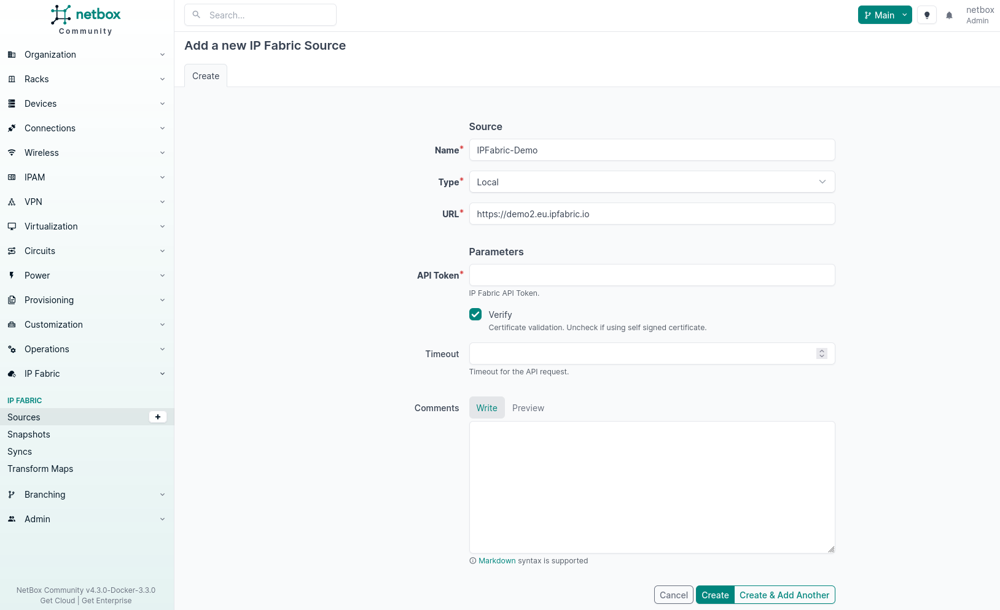
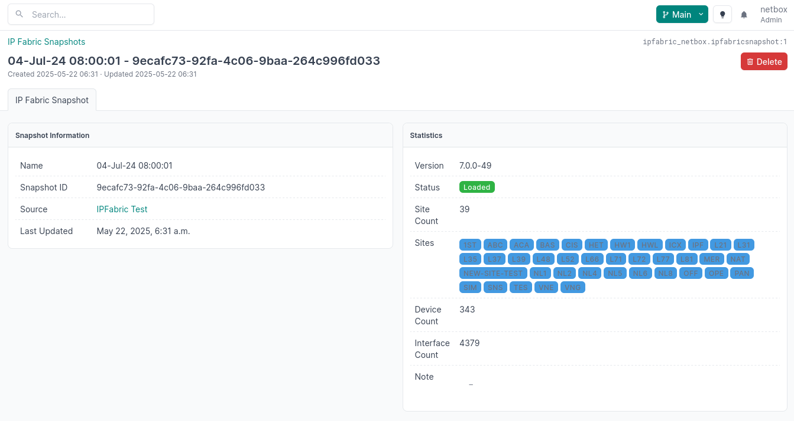

# Define Sources

Sources are a key part of the plugin, they are used to define the connection to Forward Networks. Once configured, sources will be used by background tasks to synchronize data from Forward Networks to NetBox. Multiple sources can be configured if multiple Forward Networks instances are being used such as a production and development instance.

## Prerequisites

Before creating a source, make sure you have the following information:

- Forward Networks URL
- Forward Networks API Token (obtainable via your Forward Networks administrative portal)
- Forward Networks Network ID (if required for your environment)

### Parameters

| Field       | Description                                                               | Type         |
| ----------- | ------------------------------------------------------------------------- | ------------ |
| Name        | Name of the source                                                        | `CharField`  |
| Type        | Local or Remote Collection                                                | `CharField`  |
| URL         | Forward Networks URL                                                             | `CharField`  |
| Network ID  | Optional network identifier used to scope API queries                            | `CharField`  |
| API Token   | Forward Networks API Token                                                       | `CharField`  |
| Verify      | Validate HTTPS Certificate (use false if using a self-signed certificate) | `Boolean`    |
| Description | Description for the source                                                | `CharField`  |
| Comments    | Provide additional comments for the source                                | `CharField`  |
| Tags        | Apply tags to the source                                                  | `ForeignKey` |

!!! info

    If your Forward Networks instance is using a self-signed certificate, you need to unset the `Verify` field. This will disable the validation of the certificate. Currently, there is no way to validate custom certificates, we are working on that.

## Creating a Source

To create a source, navigate to **Plugins --> Forward Networks --> Sources --> [ + ]**. In our case, the source is set to `Local`. If type is set to `Remote`, data for the snapshots will need to be pushed via API. The API endpoint to do this can be seen in the NetBox OpenAPI spec.

## Syncing a Source

Once a source has been added to NetBox, it does not mean that data will be synchronized. NetBox does not know what snapshots to synchronize from Forward Networks. So first the snapshots must be synchronized.

Navigate to your source and click the **Sync** button. This will create a background task to synchronize the snapshots from Forward Networks.

Once the synchronization has completed, you will see the number of snapshots shown within the **Related Objects** section.

## Snapshots

Clicking through to the snapshots will show you all the snapshots that have been synchronized from Forward Networks into NetBox. There will be one snapshot created with the `snapshot_id` of `$last`; this is Forward Networks' way of returning information from the API for the latest snapshot.

Each snapshot will show the following information:

- Forward Networks Version (e.g. `7.0.15`)
- Status (e.g. `Loaded`, `Unloaded`)
- Site Count (e.g. `1`)
- Sites (e.g. `Site1`, `Site2`)
- Device Count (e.g. `10`)
- Interface Count (e.g. `20`)
- Note (e.g. `Note1`)

This information is used when creating a [sync](syncs.md) to determine the snapshot and site to synchronize from Forward Networks to NetBox. This page also contains the raw JSON for the snapshot that is returned via the Forward Networks API.
