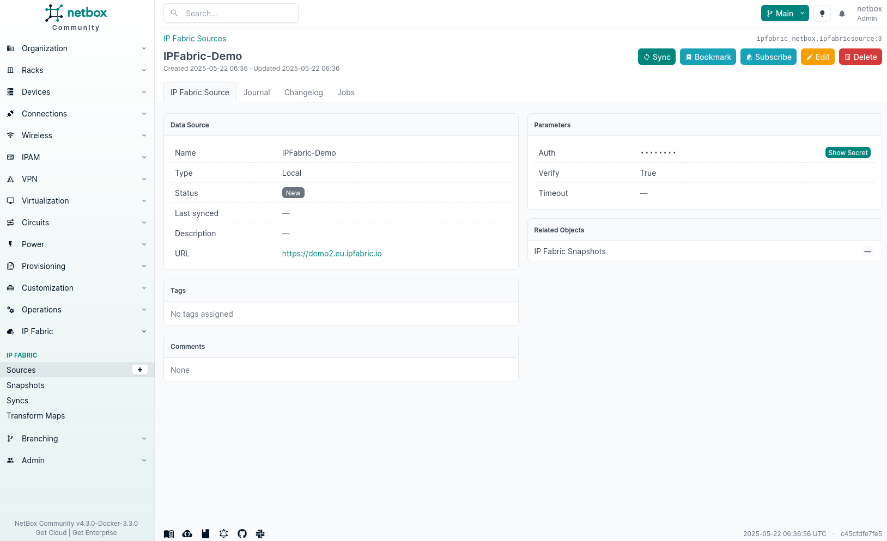
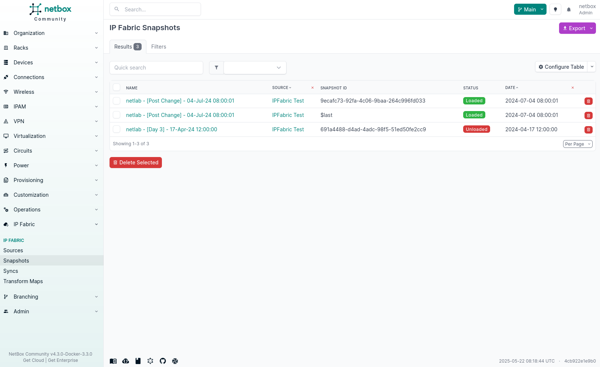

# Define Sources

Sources are a key part of the plugin, they are used to define the connection to Forward Enterprise. Once configured, sources will be used by background tasks to synchronize data from Forward Enterprise to NetBox. Multiple sources can be configured if multiple Forward Enterprise instances are being used such as a production and development instance.

## Prerequisites

Before creating a source, make sure you have the following information:

- Forward Enterprise URL
- Forward Enterprise API Token (obtainable via your Forward Enterprise administrative portal)
- Forward Enterprise Network ID (if required for your environment)

### Parameters

| Field       | Description                                                               | Type         |
| ----------- | ------------------------------------------------------------------------- | ------------ |
| Name        | Name of the source                                                        | `CharField`  |
| URL         | Forward Enterprise URL                                                      | `CharField`  |
| Network ID  | Optional network identifier used to scope API queries                     | `CharField`  |
| API Token   | Forward Enterprise API Token                                                | `CharField`  |
| Verify      | Validate HTTPS Certificate (use false if using a self-signed certificate) | `Boolean`    |
| Description | Description for the source                                                | `CharField`  |
| Comments    | Provide additional comments for the source                                | `CharField`  |
| Tags        | Apply tags to the source                                                  | `ForeignKey` |

!!! info

    If your Forward Enterprise instance is using a self-signed certificate, you need to unset the `Verify` field. This will disable the validation of the certificate. Currently, there is no way to validate custom certificates, we are working on that.

## Creating a Source

To create a source, navigate to **Plugins --> Forward Enterprise --> Sources --> [ + ]** and provide the base URL, API token, and optional network identifier. The plugin will connect directly to Forward Enterprise using these details to discover snapshots and ingest inventory data. When NetBox cannot reach Forward Enterprise (for example, in NetBox Cloud deployments), the same source object can be reused while pre-loading snapshot data through the plugin's REST API.

## Syncing a Source

Once a source has been added to NetBox, it does not mean that data will be synchronized. NetBox does not know what snapshots to synchronize from Forward Enterprise. So first the snapshots must be synchronized.

Navigate to your source and click the **Sync** button. This will create a background task to synchronize the snapshots from Forward Enterprise.

Once the synchronization has completed, you will see the number of snapshots shown within the **Related Objects** section.

## Snapshots

Clicking through to the snapshots will show you all the snapshots that have been synchronized from Forward Enterprise into NetBox. There will be one snapshot created with the `snapshot_id` of `$last`; this is Forward Enterprise's way of returning information from the API for the latest snapshot.

Each snapshot will show the following information:

- Forward Enterprise Version (e.g. `7.0.15`)
- Status (e.g. `Loaded`, `Unloaded`)
- Site Count (e.g. `1`)
- Sites (e.g. `Site1`, `Site2`)
- Device Count (e.g. `10`)
- Interface Count (e.g. `20`)
- Note (e.g. `Note1`)

This information is used when creating a [sync](syncs.md) to determine the snapshot and site to synchronize from Forward Enterprise to NetBox. This page also contains the raw JSON for the snapshot that is returned via the Forward Enterprise API.
