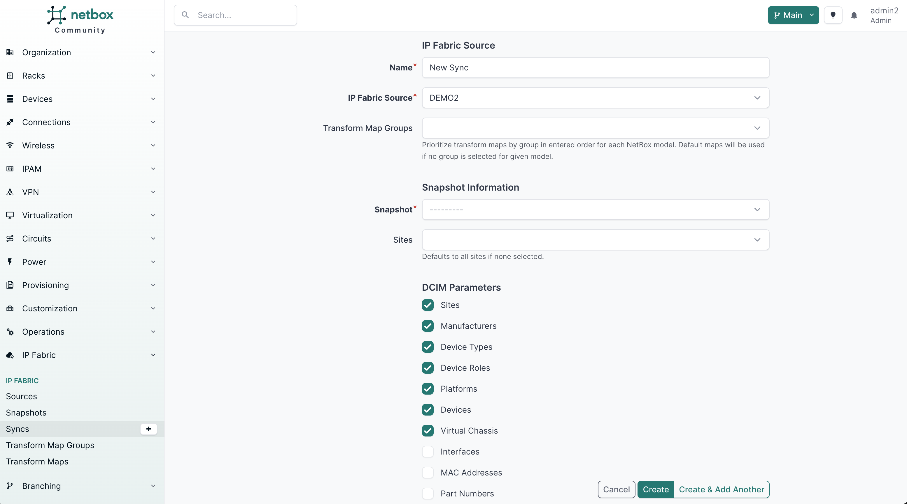

# Syncs

## Introduction

Data sync is a fundamental process in the plugin, enabling synchronization between IP Fabric and NetBox. This process involves configuring various parameters to define how data is synchronized. Configuration here defines created **ingestions** which handle synchronizing and merging the data. Let's delve into the key components of data sync.

## Configuration Parameters

A data sync configuration consists of several crucial parameters:

| Field           | Description                                                      | Type                           |
| --------------- |------------------------------------------------------------------| ------------------------------ |
| Name            | The name of the ingestion job                                    | `CharField`                    |
| Source          | The IP Fabric instance used for data synchronization with NetBox | `ForeignKey`                   |
| Snapshot        | The snapshot chosen for data synchronization with NetBox         | `ForeignKey`                   |
| Auto Merge      | Automatically merge staged changes into NetBox                   | `BooleanField`                 |
| Sites           | Optional: Limits ingestion to specific sites                     | `ChoiceField`                  |
| Sync Parameters | Models to sync during ingestion                                  | `JSONField`                    |
| Schedule At     | Specify when to start the ingestion (if required in the future)  | `DateTimeField`                |
| Recurs Every    | Determine the frequency of the ingestion                         | `PositiveIntegerField`         |
| Tags            | Apply tags to objects during ingestion                           | `ForeignKey`                   |

!!! note

    When scheduling recurring ingestions using the `Recurs Every` field, it's recommended to use the `$last` snapshot. This ensures that the ingestion always runs against the latest snapshot in IP Fabric, maintaining data consistency.

## Data Synchronization Parameters

These parameters act as toggles, allowing you to control whether models in NetBox should be created or updated, or if the ingestion should merely execute queries without making changes.

Even if a model is disabled, we continue processing the transformation map to use the data for querying certain objects. This is essential, because there may be a need to update or create another object based on the information. This aplies for the following models:
- Device is always queried when either of Interface, Mac Address, or IPAddress is enabled.
- Interface is always queried when either of Mac Address or IPAddress is enabled.

Here's a breakdown of data ingestion types and their associated synchronization parameters:

- **DCIM (Data Center Infrastructure Management)**
  - Site
  - Manufacturer
  - Device Type
  - Device Role
  - Platform
  - Device
  - Virtual Chassis
  - Interface
  - Mac Address

- **IPAM (IP Address Management)**
  - VLAN
  - VRF
  - Prefix
  - IP Address

## Data Sync Details

The data sync detail page offers insights into the ingestion configuration and its current `Status` [New, Queued, Syncing, Completed, Failed].

On the left, you can access snapshot information and the configured source for data ingestion. On the right, parameters and values.

Tabs at the top provide access to various features, including viewing [Transform Maps](transform_maps.md), [Ingestions](ingestions.md), accessing the change log, and reviewing associated jobs.

The [Transform Maps](transform_maps.md) tab displays currently used transform maps for this exact Sync. Only single one will be used for each target model, the choice is made by selecting [Transform Map Groups](transform_maps.md#transform-map-group) in the Sync configuration. The last group takes precedence, so if you have multiple groups with transform maps for the same target model, the one from the last group in the list will be used.

## Initiating a Synchronization

### Scenario 1: Fields Left Blank

During synchronization configuration, consider the **`Schedule At`** and **`Recurs Every`** fields. If left blank, the ingestion process won't start immediately upon saving. Instead, you can manually trigger synchronization by clicking the **`Sync`** button on the Ingestion Detail page.

- **Manual Initiation:** Clicking **`Sync`** will instantly start the ingestion process. However, for this to happen, there must be an available runner capable of executing the job. If no runner is available, the job will be added to the default queue. This type of synchronization is known as an **adhoc** ingestion.

### Scenario 2: Fields Populated

When you populate the **`Schedule At`** or **`Recurs Every`** fields during configuration, synchronization behavior changes:

- **Scheduled Execution:** The ingestion is scheduled to run at the specified time from the **`Schedule At`** field. It repeats at regular intervals defined in the **`Recurs Every`** field.

- **Immediate Execution (Fallback):** If you omit a specific **`Schedule At`** time, the ingestion is scheduled to start immediately upon configuration. Subsequently, it continues at the intervals set in the **`Recurs Every`** field.

In summary, the plugin offers flexibility in initiating synchronization tasks. You can manually trigger them with the **`Sync`** button or set up automatic execution at designated times and intervals to meet your specific requirements. Once initiated, the latest ingestion can be seen in the [ingestions](ingestions.md) tab.
