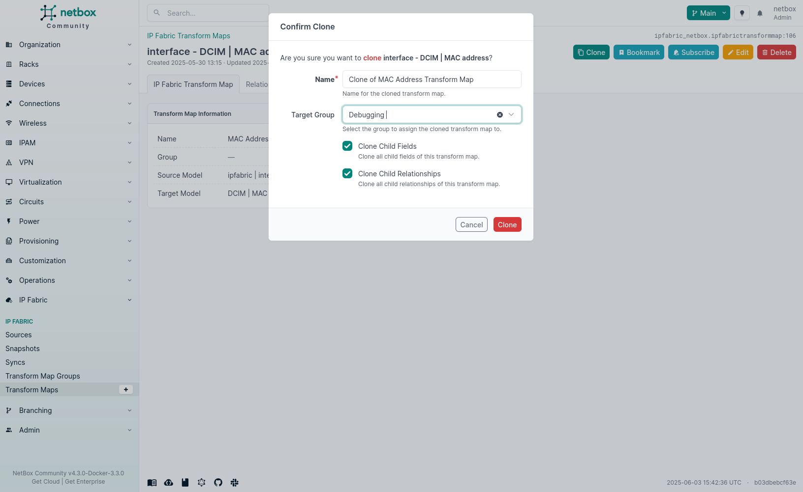
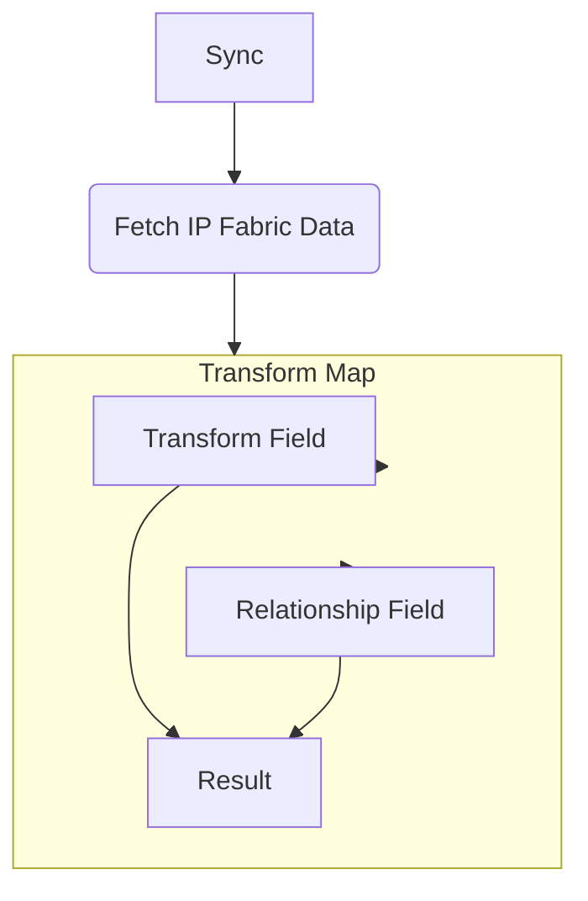

# Transform Maps

By default, we provide users with the option to create their own transform map. This allows users to customize the transform map to their specific needs. However, we also offer a default transform map that can serve as a starting point. These come pre-installed using Django migrations.

## Installation Instructions - Restore Method

Within the transform map page, you can easily restore the default transform maps. This will overwrite any existing transform maps without a group. You can do this by selecting restore in the top-right corner of the transform map page.

## Installation Instructions - Manual Method

Follow these steps to install the transform maps:

1. Download the script using `wget`:

   ```shell
   wget -O update_tm.sh "https://gitlab.com/ip-fabric/integrations/ipfabric-netbox/-/raw/main/scripts/update_tm.sh"
   ```

2. Make the script executable:

   ```shell
   chmod +x update_tm.sh
   ```

3. Run the script to install the transform maps:

   ```shell
   ./update_tm.sh
   ```

# Transform Maps

In this scenario, envision a transform map as akin to a carefully crafted recipe. This recipe serves as a guide, orchestrating the process of extracting data from IP Fabric and delicately depositing it into the appropriate "containers" represented by Django models within NetBox. Its primary objective is to guarantee precise and efficient organization of the data, meticulously tailored to meet your network management requirements. In essence, it acts as a bridge, harmonizing disparate data formats and structures, ensuring a seamless integration of your network data with your NetBox database.

The concept of transform maps is not novel; it has been widely employed in various tools for transforming data from one format to another, a practice commonly referred to as ETL (Extract, Transform, Load). This concept draws substantial inspiration from ServiceNow and their implementation of Transform Maps.

The IP Fabric plugin has four key transform map areas:

- Transform Map Groups: This is a grouping of transform maps that can be used to organize and apply them to specific sync jobs.
- Transform Map: This is the parent object that contains information about the source and destination of the data.
- Transform Map Fields: This is the mapping between the source fields and destination fields.
- Transform Map Relationship Fields: This is the mapping between the source fields and destination fields for relationships.

## Transform Map Group

Transform Map Groups are used to group transform maps together. This is useful when you want to apply the same transform map to multiple sync jobs. For example, you can create a group for all device-related transform maps and apply it to all device sync jobs.

Transform Map with group assigned takes precedence over transform maps without a group assigned. This means that if you have a transform map with a group assigned, it will be used instead of the transform map without a group assigned when this group is added to Sync settings.

### Parameters

| Field        | Description                     | Type        |
|--------------|---------------------------------|-------------|
| Name         | Name of the transform map group | `CharField` |
| Description  | Text describing this group      | `CharField` |

## Transform Map

This model serves as the parent for both Transform Map Fields and Transform Map Relationship Fields. It empowers users to select a supported source IP Fabric table and a supported target NetBox model.

The combination of `group` and `target_model` is unique, meaning that you can only have one transform map for a specific group and target model. If you attempt to create a new transform map with the same group and target model, it will raise an error.

### Parameters

| Field        | Description                                              | Type          |
|--------------|----------------------------------------------------------| ------------- |
| Name         | Name of the transform map (e.g., `Device Transform Map`) | `CharField`   |
| Group        | (optional) `IPFabric Transform Map Group`                | `ChoiceField` |
| Source Model | IP Fabric Table                                          | `ChoiceField` |
| Target Model | NetBox Model                                             | `ChoiceField` |

??? info "Source Model Choices"

    The following list is shown in this format: `IP Fabric Table (URL)`

    - Site (`/inventory/sites/overview`)
    - Inventory (`/inventory/part-numbers`)
    - Device (`/inventory/devices`)
    - Virtual Chassis (`/technology/platforms/stack/members`)
    - Interface (`/inventory/interfaces`)
    - VLAN (`/technology/vlans/site-summary`)
    - VRF (`/technology/routing/vrf/detail`)
    - Prefix (`/technology/networks/managed-networks`)
    - IP Address (`/technology/addressing/managed-ip`)

??? info "Target Model Choices"

    The following list is shown in this format: `NetBox Model (app)`

    - site (dcim)
    - manufacturer (dcim)
    - platform (dcim)
    - devicerole (dcim)
    - devicetype (dcim)
    - device (dcim)
    - virtualchassis (dcim)
    - interface (dcim)
    - macaddress (dcim)
    - vlan (ipam)
    - vrf (ipam)
    - prefix (ipam)
    - ipaddress (ipam)
    - contenttype (contenttypes)

### Cloning Transform Map

You can clone a transform map by clicking the `Clone` button in the top-right corner of the transform map detail page. This will create a new transform map with the same source and target models. Cloning of related Fields and Relationships is enabled by default.



## Transform Field

Transform fields belong to a transform map and are used to map the source fields to the destination fields. The source fields are the fields from the IP Fabric table and the destination fields are the fields from the NetBox model.

### Parameters

| Field         | Description                                                 | Type                                  |
| ------------- | ----------------------------------------------------------- | ------------------------------------- |
| Transform Map | Transform map the field is associated with                  | `ForeignKey` (`IPFabricTransformMap`) |
| Source Field  | IP Fabric Table                                             | `CharField`                           |
| Target Field  | NetBox Model                                                | `CharField`                           |
| Coalesce      | Determine if field should be used to match existing objects | `BooleanField`                        |
| Template      | Jinja Template to transform the data during ingestion       | `TextField`                           |


### Source Field

While the source field is defined as a `CharField`, it's important to note that the form restricts your selection to fields that are supported by the IP Fabric API. The list of available choices can be found in the [table description](https://docs.ipfabric.io/latest/IP_Fabric_API/index.md#technology-table-endpoints) within your IP Fabric instance, and it's limited to the models mentioned above.

### Target Field

The target field is a `CharField` and the form will only allow you to select fields that are supported by the NetBox Model and are dynamically generated based on the target model selected in the transform map.

### Coalesce

This term, also employed in [ServiceNow](https://developer.servicenow.com/dev.do#!/learn/learning-plans/utah/new_to_servicenow/app_store_learnv2_importingdata_utah_coalescing), refers to a field that determines whether it should be utilized for identifying and matching existing objects. For instance, when importing a device and aiming to match it based on the hostname, you would set the "coalesce" parameter to true. This would enable the matching process based on the hostname, and, if a device with the same hostname already exists, it would be updated accordingly.

### Template

This field provides the capability to employ a [Jinja Template](https://jinja.palletsprojects.com/en/2.11.x/) for data transformation during the ingestion process. It proves valuable when you wish to modify the data before inserting it into NetBox. For instance, you can use it to alter the data format or combine multiple fields into a single field, depending on your specific requirements.

!!! info

    If template is used the source field is ignored.

The Jinja template has access to the following variables via context data:

- `<fieldname>` -- The value of the source field (e.g., `{{ siteName }}`)
- `object` -- The full raw source dictionary from IP Fabric
  - Example: Raw data from IP Fabric for a site
    ```json
    {
            "siteName": "Site 1",
            "devicesCount": 173,
            "usersCount": 7075,
            "stpDCount": 10,
            "switchesCount": 165,
            "vlanCount": 113,
            "rDCount": 2,
            "routersCount": 12,
            "networksCount": 77
    }
    ```
  - You could select items out of this object like so: `{{ object.siteName }}`
- The template can access netBox model classes. For example:
  - ```{{ dcim.Site.objects.filter(sn=object.sn) }}```
- When `None` is returned from the template on `coalesce` field/relationship field, `field=None` will be replaced with `field__isnull=True` instead to be able to query for fields allowing `null` value. If you need an empty value, use `""` instead of `None`.


## Transform Relationship Field

Transform Relationship fields are an integral part of a transform map, designed to establish connections between various objects within NetBox. These fields encompass source fields, which originate from the IP Fabric table, and destination fields, which correspond to the fields within the NetBox model. For instance, in the context of importing a device and desiring to establish a relationship with a specific site, a transform relationship field becomes essential to achieve this linkage.

### Parameters

| Field         | Description                                                 | Type                                  |
| ------------- | ----------------------------------------------------------- | ------------------------------------- |
| Transform Map | Transform map the field is associated with                  | `ForeignKey` (`IPFabricTransformMap`) |
| Source Model  | NetBox model that will be mapped                            | `ForeignKey`                          |
| Target Field  | Field where the NetBox model will be placed.                | `CharField`                           |
| Coalesce      | Determine if field should be used to match existing objects | `BooleanField`                        |
| Template      | Jinja Template to transform the data during ingestion       | `TextField`                           |

### Source Model

The source model only allows you to select a value that is supported. When a device is imported using this plugin, there is a specific order needed to create a device. The order is as follows:

- Create site
- Create manufacturer
- Create device type
- Create platform
- Create device role
- Create device

When we create or query for each of these objects, we store them in a cache to facilitate their use by the relationship field for creating connections. For instance, when importing a device and aiming to establish a relationship with a site, you would employ a transform relationship field. In this scenario, the source model would be 'site,' and the target field would also be 'site.'

### Target Field

This field is a `CharField` and the form will only allow you to select fields that are relationship fields on the NetBox model. This is dynamically generated based on the target model selected in the transform map.

### Coalesce

This field, also referred to in [ServiceNow](https://developer.servicenow.com/dev.do#!/learn/learning-plans/utah/new_to_servicenow/app_store_learnv2_importingdata_utah_coalescing), signifies whether the field should be utilized to identify and match existing objects. For instance, if you're importing a device and wish to match it based on the hostname, you would set the "coalesce" parameter to true. This proves valuable when you need to retrieve or create an object in NetBox, especially when a standard field lacks the uniqueness required for matching. For example, an interface like `GE-1/0/1` may not be unique to just one device; it could exist on multiple devices. To uniquely identify and query, you must specify that you are searching for `GE-1/0/1` specifically on `device1`.

### Template

Much like the transform field, this field enables the utilization of a [Jinja Template](https://jinja.palletsprojects.com/en/2.11.x/) to manipulate data during the ingestion process. This proves valuable when you prefer not to rely on cached objects related to devices and need to execute a more intricate query. The template query can return an `integer` or values such as True, False and None. If an `integer` is returned it is combined with the `source_model`, to facilitate the establishment of a relationship between the resulting object and the target model. If a value such as True, False or None is returned, it will insert these values into the target field. If the template returns an empty string, it will not create a relationship.

!!! info
    If template is used, the source model cache is ignored.

The Jinja template has access to the following variables via context data:

- `object` -- The full raw source dictionary from IP Fabric
  - Example: Raw data from IP Fabric for a site
    ```json
    {
            "siteName": "Site 1",
            "devicesCount": 173,
            "usersCount": 7075,
            "stpDCount": 10,
            "switchesCount": 165,
            "vlanCount": 113,
            "rDCount": 2,
            "routersCount": 12,
            "networksCount": 77
    }
    ```
  - You could select items out of this object like so: `{{ object.siteName }}`
- NetBox model classes can be accessed by the template. For example:
  - ```{{ dcim.Device.objects.filter(site=object.siteName).first().pk }}```


## Flow Chart


