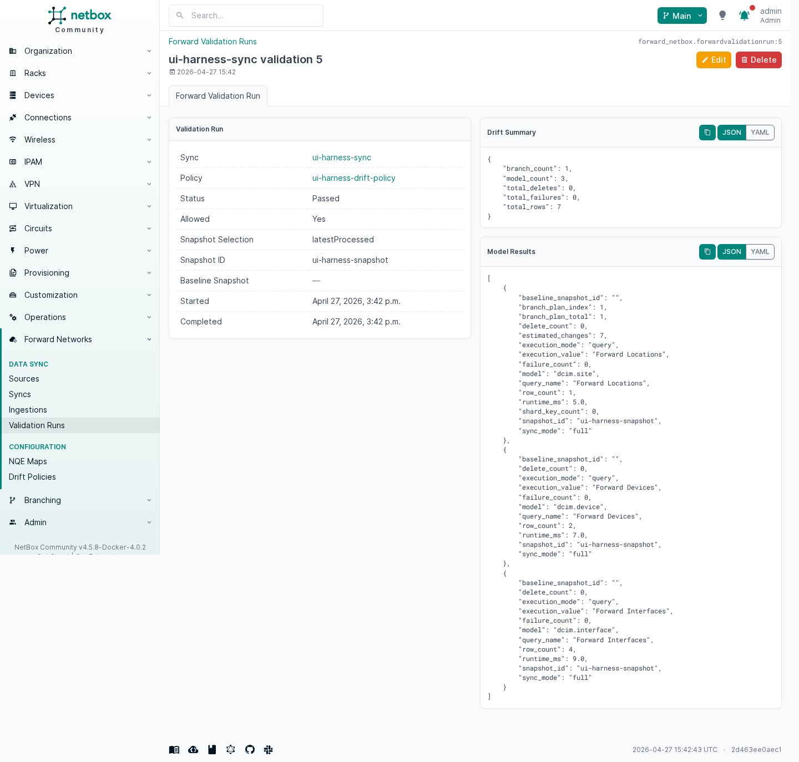

# Usage and Validation

Run a sync from the `Forward Sync` detail page. The plugin executes the enabled NetBox models through the configured NQE maps, stages the resulting NetBox changes in a branch, records failures as `Forward Ingestion Issues`, and then lets you merge the staged branch into main NetBox.

## Self-Test Workflow

Use this flow to validate a new installation from the UI.

### 1. Create A Source

Open `Plugins > Forward Networks > Sources > Add`.

Fill in:

- `Type`: `Forward SaaS` for `https://fwd.app`, or `Custom Forward deployment` for another URL
- `Username`
- `Password`
- `Network`

Important:

- `Network` will remain empty until the Forward account has both username and password configured.

Expected result:

- The form loads without errors.
- The `Network` field populates from the authenticated Forward tenant.
- Saving the source returns you to the source detail page.


### 2. Review Built-In NQE Maps

Open `Plugins > Forward Networks > NQE Maps`.

Expected result:

- The seeded built-in maps are present.
- Each built-in map shows a `NetBox Model`, execution mode, and enabled state.
- Opening a built-in map displays either the shipped raw NQE text or the configured `Query ID`.


### 3. Create A Sync

Open `Plugins > Forward Networks > Syncs > Add`.

Recommended first pass:

- Select the source you just created.
- Optionally select a `Drift policy` if you want validation to block unsafe changes before any branch is created.
- Leave `Snapshot` at `latestProcessed`.
- Leave `Max changes per branch` at `10000` unless local Branching guidance says otherwise.
- Keep the default model selection enabled.
- Leave `Auto merge` enabled to advance through all native Branching shards automatically.
- Disable `Auto merge` when you want to review and manually merge each shard before clicking `Continue Ingestion`.

Expected result:

- The sync saves cleanly.
- The sync detail page shows the selected source, network, snapshot selection, drift policy, latest validation result, and enabled model list.


### 4. Validate The Sync

From the sync detail page, click `Validate`.

Expected result:

- A `Forward Validation Run` is created without creating NetBox Branching branches.
- The validation run records the resolved snapshot, optional baseline snapshot, per-model query results, drift summary, and blocking reasons.
- If the selected drift policy blocks the run, the sync can be corrected before staging NetBox changes.



### 5. Run An Adhoc Ingestion

From the sync detail page, click `Adhoc Ingestion`.

Expected result:

- A validation run is recorded before branch creation.
- A new `Forward Ingestion` is created.
- The sync status progresses into the branch-backed staging flow.
- The sync creates one ingestion per shard, and each shard links to its native NetBox Branching branch.
- The ingestion records both the selected snapshot mode and the resolved snapshot ID used for NQE execution.
- The ingestion links to the validation run and persists per-model query execution results.
- If `Auto merge` is disabled, the sync pauses after the current shard reaches `Ready to merge`.

### 6. Review The Ingestion

Open the ingestion detail page and inspect:

- status and timestamps
- snapshot selection and resolved snapshot ID
- snapshot state and processed time
- Forward snapshot metrics
- model results and validation status
- ingestion issues
- change diff
- branch linkage

Expected result:

- The ingestion detail page loads successfully.
- The ingestion shows the snapshot actually used for NQE execution.
- The ingestion shows Forward snapshot metrics for the selected snapshot when Forward returns them.
- The ingestion shows per-model execution mode, row count, delete count, runtime, and shard metadata when available.
- `Issues` is empty or contains actionable query/persistence errors.
- The change diff represents the staged NetBox changes for review.


### 7. Confirm The Merged Branches

With `Auto merge` enabled, Forward syncs merge each native Branching shard before the next shard runs. With `Auto merge` disabled, review and merge the current shard, then click `Continue Ingestion` on the sync to stage the next shard.

Expected result:

- Each shard branch is marked merged.
- The synced objects are visible in standard NetBox object views.

## What To Check After A Successful Test

- Sites, devices, interfaces, prefixes, and the other selected models exist in NetBox.
- The latest ingestion has no unresolved issues.
- The latest ingestion shows the expected snapshot selector, resolved snapshot ID, and Forward metrics.
- The branch diff matches the expected object additions and updates.
- The source and sync statuses are back in a healthy state.

## CLI Smoke Validation

For a repeatable live smoke run outside GitHub Actions, use the bundled management command through the local invoke task.

Set the required environment variables:

```bash
export FORWARD_SMOKE_USERNAME='your-forward-username'
export FORWARD_SMOKE_PASSWORD='your-forward-password'
export FORWARD_SMOKE_NETWORK_ID='your-network-id'
```

Run the smoke sync:

```bash
invoke forward_netbox.smoke-sync
```

Optional knobs:

- `FORWARD_SMOKE_URL` defaults to `https://fwd.app`
- `FORWARD_SMOKE_SNAPSHOT_ID` defaults to `latestProcessed`
- `FORWARD_SMOKE_MODELS` accepts a comma-separated list of enabled NetBox models
- `invoke forward_netbox.smoke-sync --validate-only` resolves the source/network/snapshot and executes the selected queries without creating an ingestion
- `--query-limit` limits rows fetched per query during `--validate-only`; normal syncs page through the full NQE result set
- `invoke forward_netbox.smoke-sync --plan-only --max-changes-per-branch 10000` prints the native NetBox Branching shard plan for large baselines
- `invoke forward_netbox.smoke-sync --max-changes-per-branch 10000` stages and merges large baselines in multiple native branches
- `invoke forward_netbox.smoke-sync --no-auto-merge --max-changes-per-branch 10000` stages one native Branching shard and pauses for review

The normal UI/API `Run Sync` path uses the same native multi-branch execution. Use the command-line smoke sync when you need explicit plan-only output or a targeted model subset.

## Optional Module Import Readiness

The built-in `Forward Modules` map is disabled by default. The native `dcim.module` import path is beta in `v0.6.x`: use it when you want chassis modules, line cards, supervisors, fabric modules, or routing engines modeled as native NetBox `dcim.module` objects instead of generic inventory items, and review the staged branch carefully before merging.

NetBox modules require matching module bays on the device. When `dcim.module` is enabled, the sync creates missing module bays with native NetBox model operations in the same branch shard as the module import. To preview that work before enabling the model, run the readiness helper against the same Forward Sync you plan to use:

```bash
python manage.py forward_module_readiness --sync-name "Forward Sync"
```

Local Docker shortcut:

```bash
invoke forward_netbox.module-readiness --sync-name "Forward Sync"
```

Expected result:

- the helper runs the module NQE map through the normal Forward API path
- it compares every `(device, module_bay)` result to existing NetBox module bays
- it writes `summary.json` and `netbox-module-bays.csv`
- if you want to pre-stage module bays before the sync, import `netbox-module-bays.csv` through the native NetBox `Module Bays` import UI, then rerun the helper
- if you do not pre-import the CSV, the sync creates the missing module bays in the native Branching diff when `dcim.module` is enabled

After the readiness helper reports zero missing devices, enable the `dcim.module` model and the `Forward Modules` NQE map for the sync. SFPs and other optics remain in the inventory-item path by default. When module sync is enabled, matching generic inventory rows for module-native component classes are removed during inventory ingestion so the same hardware is not represented twice.

Expected result:

- the command creates or updates a disposable smoke `Source` and `Sync`
- the sync resolves the selected snapshot and runs a real ingestion
- the sync records validation and per-model execution metadata before branch staging
- the command exits non-zero if the sync fails or any ingestion issues are recorded
- in `--validate-only` mode, the command prints per-model query execution mode, row count, and runtime and exits non-zero on any query failure
