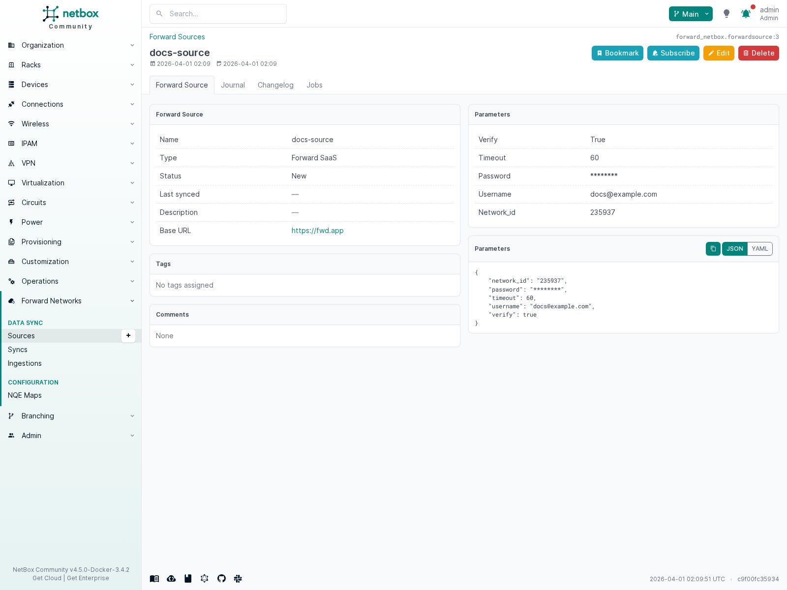
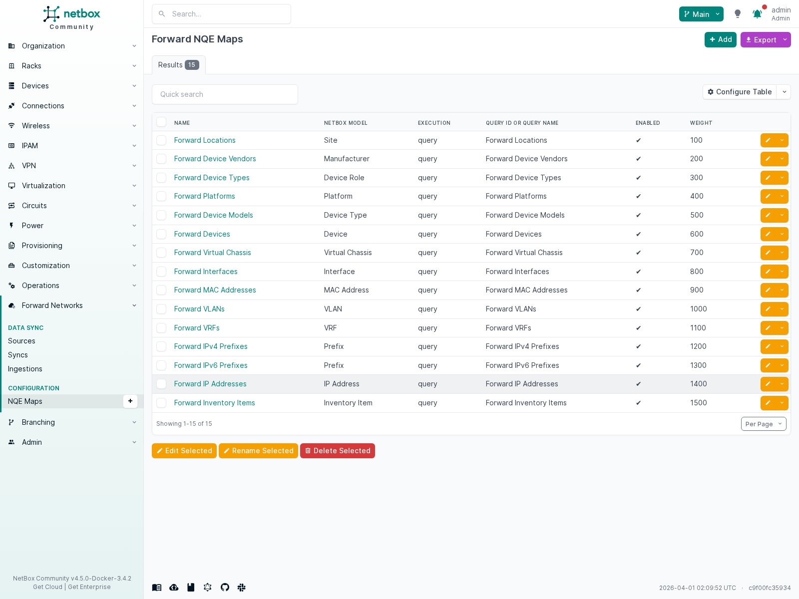
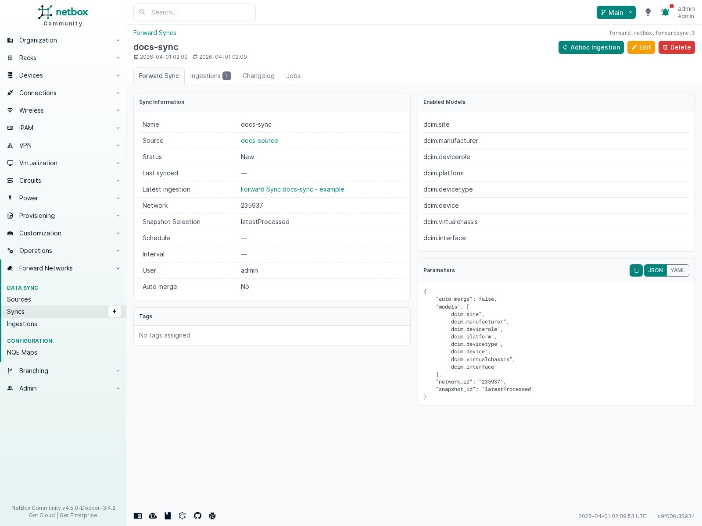
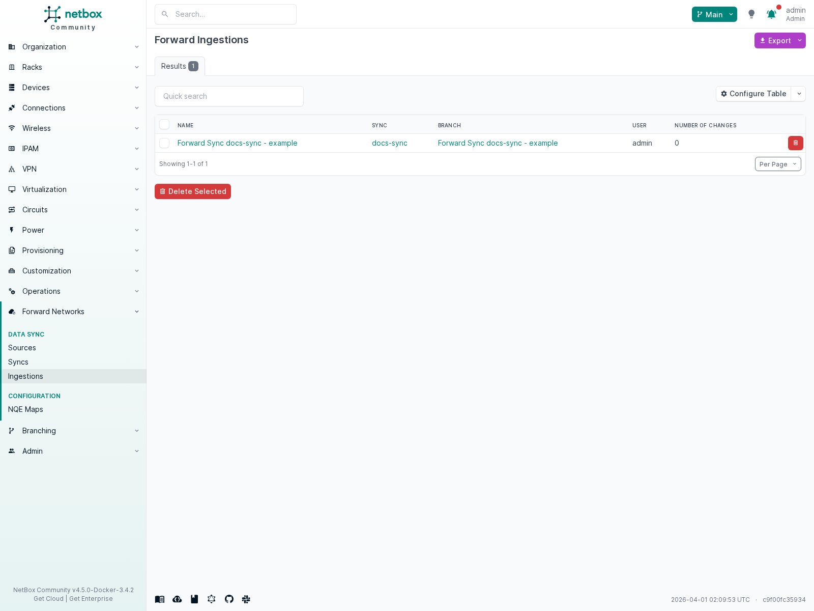
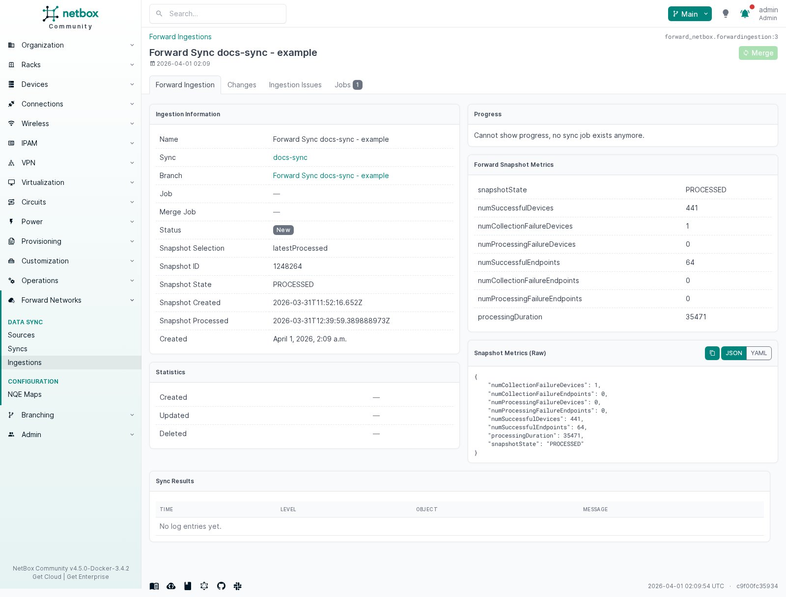

# Usage and Validation

Run a sync from the `Forward Sync` detail page. The plugin executes the enabled NetBox models through the configured NQE maps, stages the resulting NetBox changes in a branch, records failures as `Forward Ingestion Issues`, and then lets you merge the staged branch into main NetBox.

## Self-Test Workflow

Use this flow to validate a new installation from the UI.

### 1. Create A Source

Open `Plugins > Forward Networks > Sources > Add`.

Fill in:

- `Type`: `Forward SaaS` for `https://fwd.app`, or `Custom Forward deployment` for another URL
- `Username`
- `Password`
- `Network`

Expected result:

- The form loads without errors.
- The `Network` field populates from the authenticated Forward tenant.
- Saving the source returns you to the source detail page.



### 2. Review Built-In NQE Maps

Open `Plugins > Forward Networks > NQE Maps`.

Expected result:

- The seeded built-in maps are present.
- Each built-in map shows a `NetBox Model`, execution mode, and enabled state.
- Opening a built-in map displays either the shipped raw NQE text or the configured `Query ID`.



### 3. Create A Sync

Open `Plugins > Forward Networks > Syncs > Add`.

Recommended first pass:

- Select the source you just created.
- Leave `Snapshot` at `latestProcessed`.
- Keep the default model selection enabled.
- Leave `Auto merge` disabled for the first test.

Expected result:

- The sync saves cleanly.
- The sync detail page shows the selected source, network, snapshot selection, and enabled model list.



### 4. Run An Adhoc Ingestion

From the sync detail page, click `Adhoc Ingestion`.

Expected result:

- A new `Forward Ingestion` is created.
- The sync status progresses into the branch-backed staging flow.
- The ingestion links to the created branch and any job records.
- The ingestion records both the selected snapshot mode and the resolved snapshot ID used for NQE execution.

### 5. Review The Ingestion

Open the ingestion detail page and inspect:

- status and timestamps
- snapshot selection and resolved snapshot ID
- snapshot state and processed time
- Forward snapshot metrics
- ingestion issues
- change diff
- branch linkage

Expected result:

- The ingestion detail page loads successfully.
- The ingestion shows the snapshot actually used for NQE execution.
- The ingestion shows Forward snapshot metrics for the selected snapshot when Forward returns them.
- `Issues` is empty or contains actionable query/persistence errors.
- The change diff represents the staged NetBox changes for review.





### 6. Merge The Branch

If the staged changes are correct, merge the ingestion branch.

Expected result:

- The merge job completes successfully.
- The branch is removed if you keep the default merge option.
- The synced objects are visible in standard NetBox object views.

## What To Check After A Successful Test

- Sites, devices, interfaces, prefixes, and the other selected models exist in NetBox.
- The latest ingestion has no unresolved issues.
- The latest ingestion shows the expected snapshot selector, resolved snapshot ID, and Forward metrics.
- The branch diff matches the expected object additions and updates.
- The source and sync statuses are back in a healthy state.

## CLI Smoke Validation

For a repeatable live smoke run outside GitHub Actions, use the bundled management command through the local invoke task.

Set the required environment variables:

```bash
export FORWARD_SMOKE_USERNAME='your-forward-username'
export FORWARD_SMOKE_PASSWORD='your-forward-password'
export FORWARD_SMOKE_NETWORK_ID='your-network-id'
```

Run the smoke sync:

```bash
invoke forward_netbox.smoke-sync
```

Optional knobs:

- `FORWARD_SMOKE_URL` defaults to `https://fwd.app`
- `FORWARD_SMOKE_SNAPSHOT_ID` defaults to `latestProcessed`
- `FORWARD_SMOKE_MODELS` accepts a comma-separated list of enabled NetBox models
- `invoke forward_netbox.smoke-sync --merge` will merge the staged branch after a clean run

Expected result:

- the command creates or updates a disposable smoke `Source` and `Sync`
- the sync resolves the selected snapshot and runs a real ingestion
- the command exits non-zero if the sync fails or any ingestion issues are recorded
