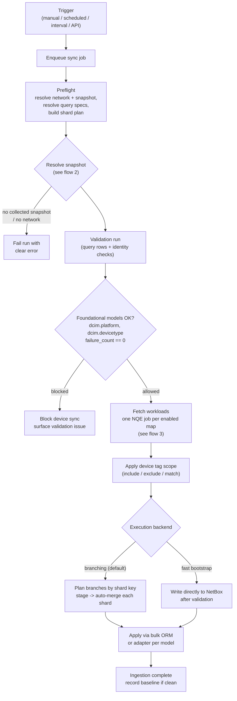
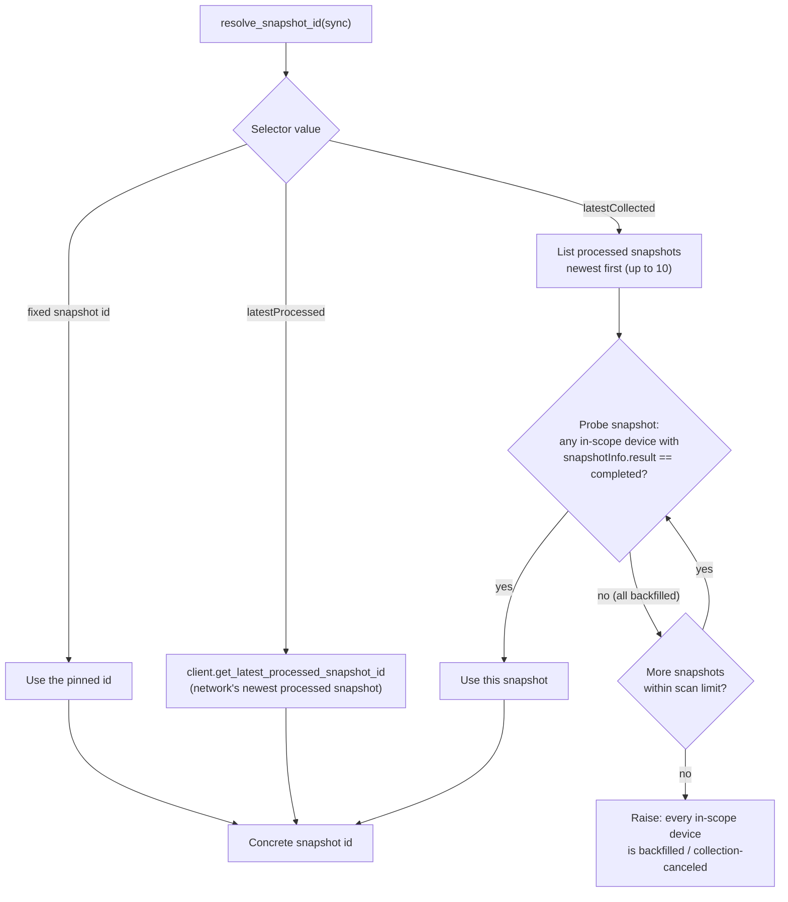
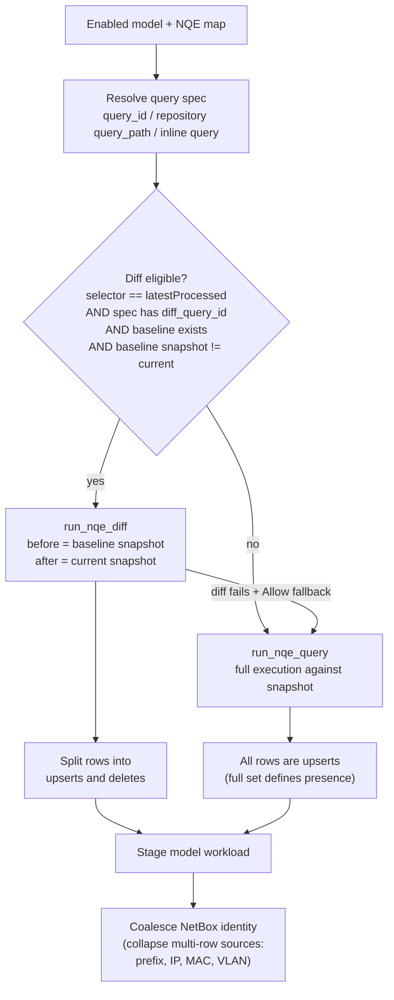

# Architecture Flow

How a Forward NetBox sync moves data from a Forward Networks snapshot into
NetBox. The plugin runs inside NetBox: it reads from the Forward platform over
the public NQE/API and writes to the local NetBox database. It never writes back
to Forward.

Three flows are documented:

1. **Sync execution pipeline** — end-to-end run from trigger to merge.
2. **Snapshot selector resolution** — how `latestProcessed`, `latestCollected`,
   and a pinned snapshot resolve to a concrete snapshot.
3. **Per-model query execution** — how each model resolves to a Forward NQE
   diff or a full query, and how rows become upserts and deletes.

---

## 1. Sync execution pipeline

A sync is triggered manually, on a schedule/interval, or via the REST API. The
job runs a preflight, a gating validation run, query fetch, and then applies
changes through the selected execution backend.

Notes:

- The validation run gates the device sync. If the foundational models
  `dcim.platform` or `dcim.devicetype` report any query failures, the run is
  blocked before `dcim.device` is touched.
- `Branching` stages each shard as a native NetBox Branching branch and merges
  serially. `Auto merge` advances shards automatically; with it off the run
  pauses for review after each shard.
- Per-model apply uses the parity-tested bulk ORM safe set where eligible and
  the adapter path for models with dependency, relationship, or IPAM-hierarchy
  contracts.

---

## 2. Snapshot selector resolution

The sync `Snapshot` field is a selector, not always a fixed id. It resolves to a
concrete snapshot at runtime.

Notes:

- All built-in queries only ingest devices whose snapshot collection `result`
  is `completed`. Backfilled (collection-canceled) devices are intentionally
  excluded.
- `latestProcessed` can resolve to a snapshot whose devices were all backfilled;
  that run logs a warning and applies zero changes.
- `latestCollected` skips those snapshots and resolves to the most recent
  snapshot that actually collected an in-scope device. Because the resolved
  snapshot can change between runs, `latestCollected` always runs a full fetch
  rather than a Forward `nqe-diff`.
- The in-scope set respects the source's device tag scope, so the probe only
  counts devices the sync would actually fetch.

---

## 3. Per-model query execution

Each enabled NetBox model maps to one or more Forward NQE queries. The plugin
prefers a Forward-computed row diff when it can, and falls back to a full query
otherwise.

Notes:

- Diff execution requires a clean prior baseline on an older snapshot. The first
  run for a model is always a full baseline.
- `Diff fallback mode` controls what happens when a diff-eligible map cannot run
  as a diff: `Allow full fallback` keeps the run moving; `Require diff` fails
  fast instead.
- Org Repository-backed `query_path` and direct `query_id` maps are diff-capable;
  inline `query` text always runs full.

---

## Key properties

| Property | Behavior |
| --- | --- |
| Direction | Read-only from Forward; writes only to the local NetBox database. |
| Source of truth | Forward NQE against the selected snapshot. |
| Device collection filter | Only `snapshotInfo.result == completed` devices are ingested; backfilled devices are excluded. |
| Snapshot selectors | `latestProcessed` (newest processed), `latestCollected` (newest with a collected in-scope device), or a pinned snapshot id. |
| Validation gate | Foundational models `dcim.platform` and `dcim.devicetype` must pass before device sync proceeds. |
| Default backend | `Branching` — native NetBox Branching shards, serial auto-merge. |
| Diff vs full | Forward `nqe-diff` on eligible `latestProcessed` runs with a prior baseline; full query otherwise. |
| Device tag scope | Optional include/exclude tag filter on the source narrows every query and the `latestCollected` probe. |

See [Configuration](../01_User_Guide/configuration.md) for the field-level
reference and operating guidance.
