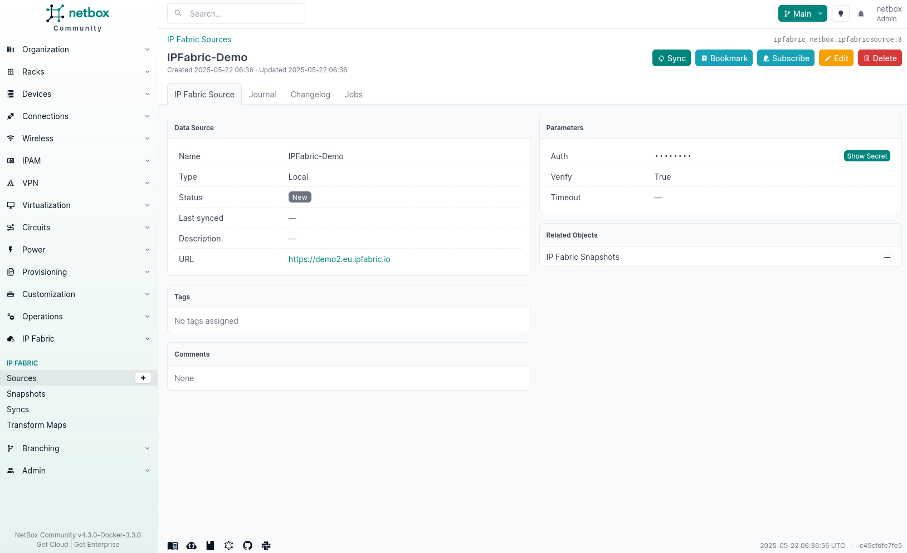
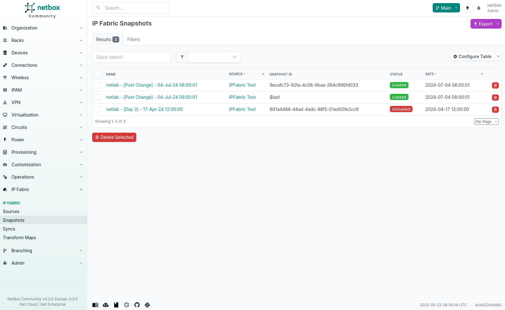
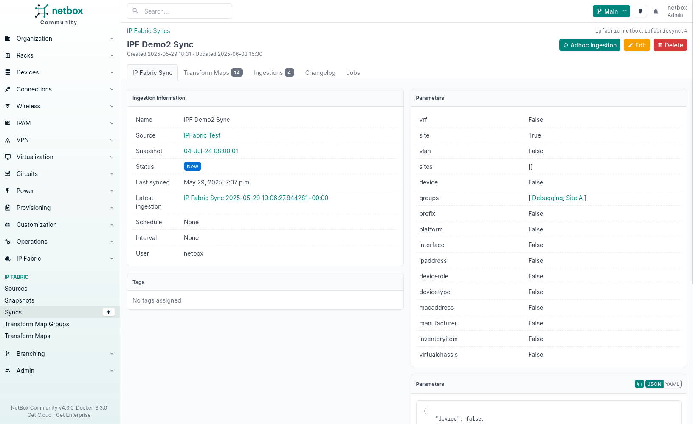

# NetBox plugin Overview

The Forward Enterprise NetBox plugin enables data synchronization between Forward Enterprise and NetBox platforms. This plugin serves as a bridge between network discovery (Forward Enterprise) and source of truth (NetBox), allowing network engineers and operators to maintain a single source of truth for network infrastructure data.

## Key Features

### Data Synchronization
The plugin connects directly to the Forward Enterprise REST / NQE API, collecting structured network data from Forward Enterprise instances and transforming it to NetBox's data model—no additional Forward SDK is required.
For field-level JSON examples and query snippets, see the [NQE reference](../nqe/index.md).

### Branches
Built on [NetBox Branching](https://docs.netboxlabs.com/netbox-extensions/branching/) feature, the plugin allows review of proposed changes before they are applied to the production database, providing an additional layer of validation and control.

### Scheduled Operations
Administrators can configure automated, periodic synchronization jobs to ensure NetBox data remains current with the actual network state discovered by Forward Enterprise.

### Visual Differencing
The plugin provides visual differencing capabilities to easily identify changes between synchronization operations, making it simple to track network infrastructure evolution over time.

### Multiple Source Support
Connect to multiple Forward Enterprise instances simultaneously, allowing for comprehensive network visibility across different environments or network segments.

## Use Cases

- **Network Documentation Automation**: Automatically document network devices, interfaces, IP addresses, VLANs, cables, and virtual chassis discovered by Forward Enterprise
- **Configuration Validation**: Compare intended network state (NetBox) with actual state (Forward Enterprise)
- **Change Management**: Review and approve network changes through the staged changes workflow
- **Network Inventory Management**: Maintain accurate inventory of network devices and components
- **Physical Connectivity Tracking**: Build and validate cable relationships between Forward interfaces in NetBox
- **IP Address & Routing Management**: Synchronize IP address allocation alongside VRFs and prefixes

## NetBox Compatibility

The plugin requires specific NetBox versions due to API changes and feature dependencies. Please ensure compatibility before installation.

| NetBox Version | Plugin Version | Release Date | Key Notes                                      |
|----------------|----------------|--------------|------------------------------------------------|
| 4.4.0 and up   | 1.0.x          | 2025-10-13   | First public release, REST/NQE API integration |

## Important Notes

!!! danger "Installation Location"
    Integrations should be installed outside of the Forward Enterprise appliance unless the Forward Networks team explicitly instructs otherwise.

!!! warning "System Access"
    Any action on the Command-Line Interface (CLI) using the `root`, `osadmin`,
    or `autoboss` account may cause irreversible, detrimental changes to the
    product. Actions taken without direct communication with the Forward Enterprise
    Support or Solution Architect teams can render the system unusable.

## Screenshots from NetBox UI

### Image 1: Forward Enterprise Source Details
This image shows the details page for an Forward Enterprise source named `Forward Enterprise-Demo` in the NetBox interface. The page displays key configuration information including:

- Source type: `Local`
- Status: `New`
- URL: `https://demo2.eu.forward.io`
- Authentication credentials (masked with asterisks)
- Verification and timeout settings
- No tags or comments have been assigned
- The source was created and last updated on May 22, 2025

The left sidebar shows the hierarchical navigation menu for the NetBox interface with Forward Enterprise functionality integrated as a section. Action buttons at the top allow for syncing, bookmarking, subscribing, editing, or deleting the source.

### Image 2: Forward Enterprise Snapshots Management
This image displays the Forward Enterprise Snapshots management page, showing 6 snapshots from the Forward Enterprise-Demo source. The snapshots are listed chronologically with the following details:

- Name (mostly following `netlab - [snapshot type]` naming convention)
- Source (all from `Forward Enterprise Test`)
- Snapshot ID (unique identifiers)
- Status (`Loaded`/`Unloaded`)
- Date (ranging from April 2024 to July 2024)

The snapshots include various types such as `Post Change` and `Day 3`. Each snapshot has a delete option, and there's a `Delete Selected` button at the bottom for batch operations. The table is configurable and supports filtering and searching.

### Image 3: Forward Enterprise Sync Details
This image shows an active sync configuration named `FWD Demo2 Sync`. The page displays:

Sync information section showing:

- Name: `FWD Demo2 Sync`
- Source: `Forward Enterprise Test`
- Snapshot: `04-Jul-24 08:00:01`
- Status: `Syncing`
- Latest branch timestamp
- No schedule or interval set
- User: `netbox`

Parameters section listing various network elements being ingested:

- All key network parameters (VRF, site, vlan, device, etc.) are set to `True`
- Sites parameter shows an empty array `[]`
- Groups parameter is set to `['Debugging', 'Site A']` in this order

The page has action buttons for `Adhoc Ingestion`, `Edit`, and `Delete` operations. There are also tabs for `Forward Enterprise Sync`, `Tranform Maps`, `Ingestions`, and `Changelog` with job information.

